# Установка библиотек

Для обеспечения полноценной работы проекта SunriseWorkbench необходимо установить пакет дополнительных библиотек, поставляемых в виде `.zip`-архивов.

!!! note "Предварительное требование"
    Перед установкой библиотек убедитесь, что проект создан или загружен. Обратитесь к разделу [Создание нового проекта](new-project.md) или [Загрузка готового проекта](load-project.md).

## Открытие настроек

В строке меню главного окна SunriseWorkbench выберите **Window → Preferences**. В открывшемся окне перейдите в раздел **Install/Update → Available Software Sites**.

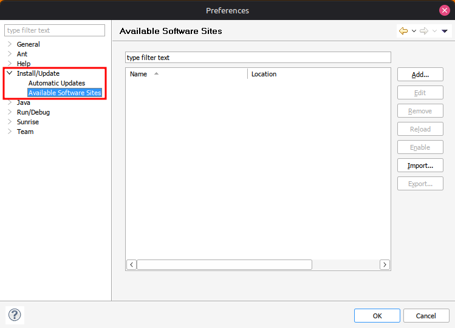

## Добавление архивов библиотек

Нажмите кнопку **Add**. В появившемся диалоговом окне добавьте `.zip`-архив с библиотеками через кнопку **Archive...**.

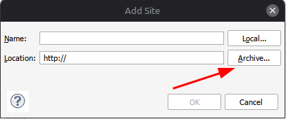

### Для пользователей Windows

Текст...

### Для пользователей Linux

Поскольку SunriseWorkbench работает в эмулированной Windows-среде, для доступа к файловой системе Linux необходимо выполнить следующие действия:

1. В диалоге выбора файла нажмите поле **Искать в:** и выберите **Мой компьютер**.

    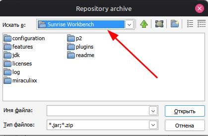

2. Отобразится список всех смонтированных дисков. Их количество может превышать фактическое число физических накопителей — это особенность работы эмулятора.

    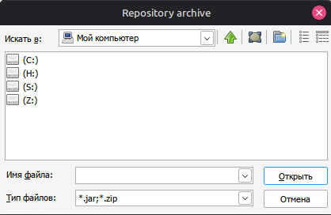

3. Последовательно проверьте каждый диск. В одном из них будет отображена файловая система Linux (в примере — диск H).

    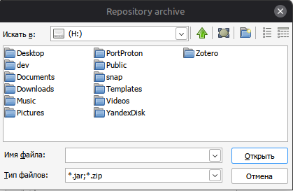

4. Перейдите в папку с библиотеками, выберите один из `.zip`-архивов и нажмите **OK**.

    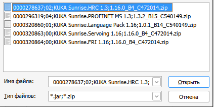
    
5. В открывшемся окне подтвердите выбор архива, нажав **OK**.

    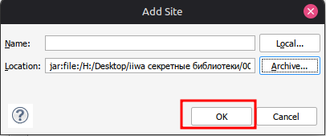

## Добавление оставшихся архивов

В списке **Available Software Sites** должна появиться запись с добавленным архивом. Повторите процедуру для всех оставшихся `.zip`-файлов библиотек.

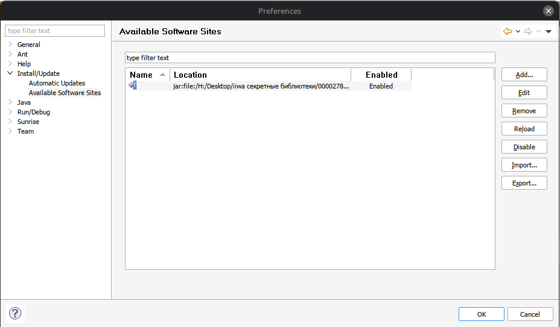

После добавления всех архивов нажмите **OK** для сохранения настроек.

## Установка библиотек

В строке меню выберите **Help → Install New Software...**.
В открывшемся окне в поле **Work with** выберите **All Available Sites** — в списке отобразятся компоненты из всех добавленных архивов.

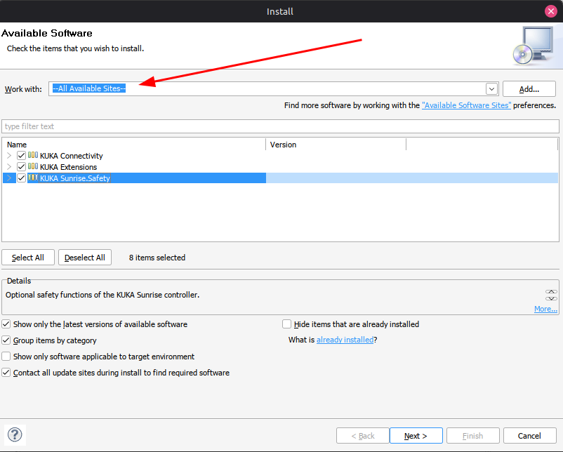

Установите флажки напротив всех доступных компонентов и нажмите **Next**.
Ознакомьтесь со сводкой устанавливаемых компонентов и нажмите **Next**.

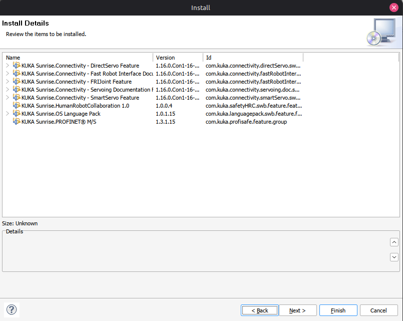

Примите условия лицензионных соглашений и нажмите **Finish** — начнётся процесс установки.

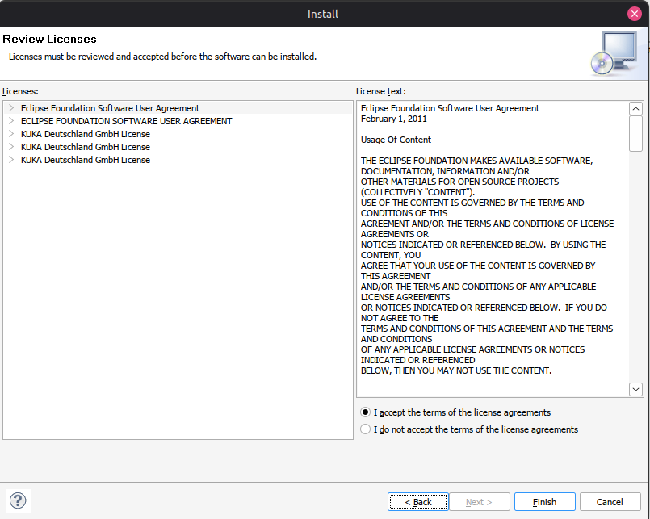

!!! warning "Продолжительность установки"
    Установка библиотек может занять значительное время. Не прерывайте процесс.
    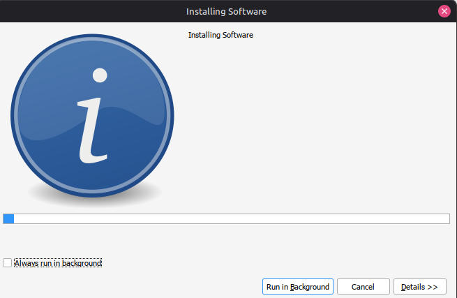

## Перезапуск приложения

По завершении установки SunriseWorkbench предложит выполнить перезапуск. Нажмите **Restart Now**.

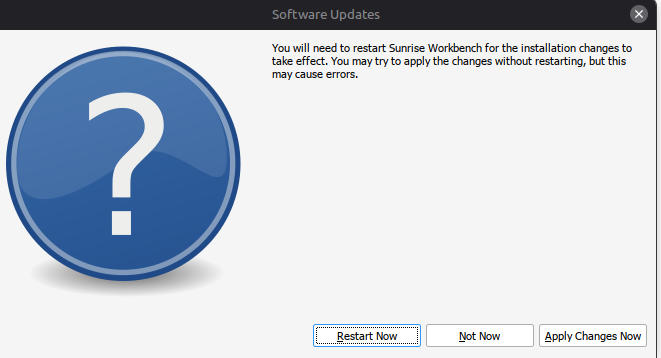

После перезапуска интерфейс переключится на русский язык, а в файле `StationSetup.cat` появятся все установленные библиотеки.

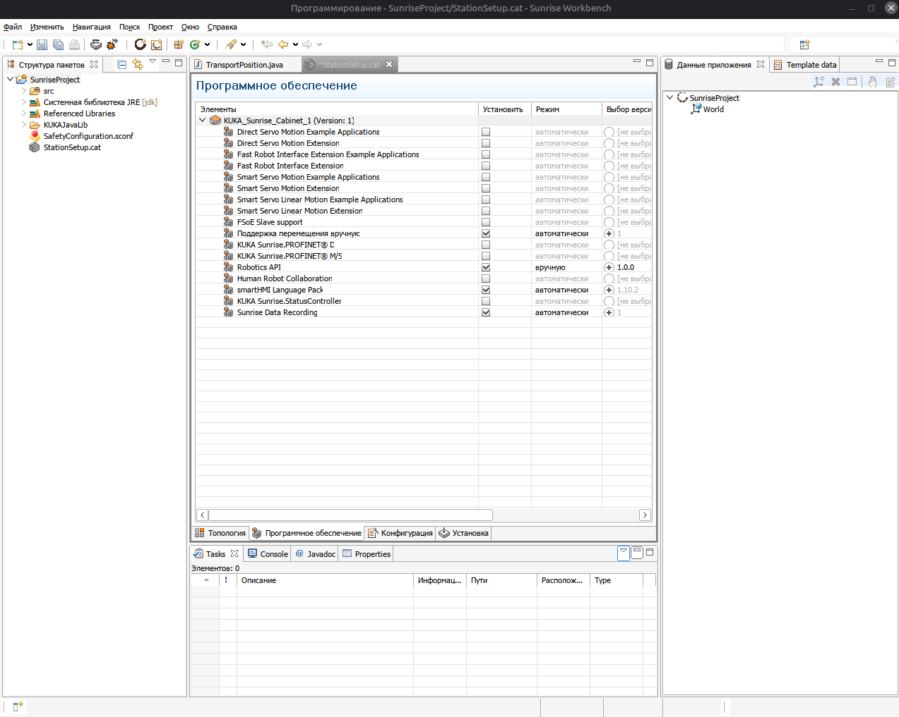

!!! tip "Следующий шаг"
    Если проект ещё не настроен, перейдите к разделу [Создание нового проекта](new-project.md) или [Загрузка готового проекта](load-project.md).