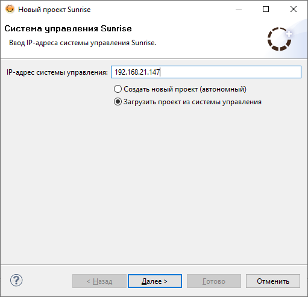
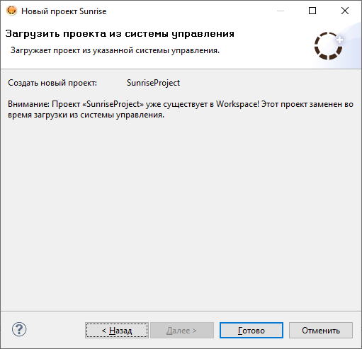
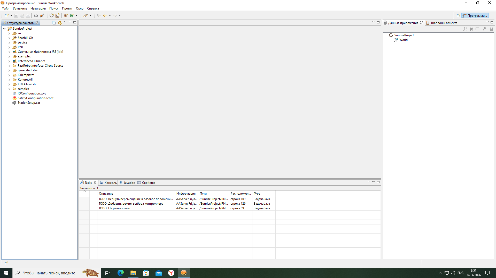

# Загрузка проекта с контроллера

В данном разделе описана процедура импорта существующего проекта непосредственно с контроллера KUKA в среду SunriseWorkbench.

!!! note "Предварительное требование"
    Убедитесь, что SunriseWorkbench установлен и запущен. Инструкции по установке приведены в разделах [Windows](../install/windows.md) и [Linux](../install/linux/linux.md).

## Запуск мастера импорта проекта

В главном окне SunriseWorkbench нажмите кнопку **New Sunrise Project**.

В открывшемся диалоговом окне выберите опцию **Load project from controller** и введите IP-адрес контроллера KUKA Sunrise Cabinet.

!!! info "IP-адрес контроллера"
    IP-адрес контроллера по умолчанию: `172.31.1.147`. Если контроллер был предварительно перенастроен, необходимо указать актуальный IP-адрес. В данной конфигурации используется адрес `192.168.21.147`. Для получения текущего IP-адреса обратитесь к разделу [Настройка станции](../kuka/features/station.md).

Нажмите **Next** — начнётся загрузка проекта с контроллера.

После завершения загрузки импортированный проект отобразится в дереве проектов SunriseWorkbench. В данном примере проект называется `SunriseProject`.

!!! tip "Следующий шаг"
    Для полноценной работы с роботом необходимо установить все требуемые библиотеки. Инструкции приведены в разделе [Установка библиотек](libraries.md).