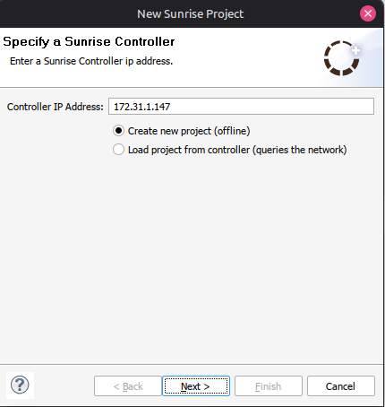
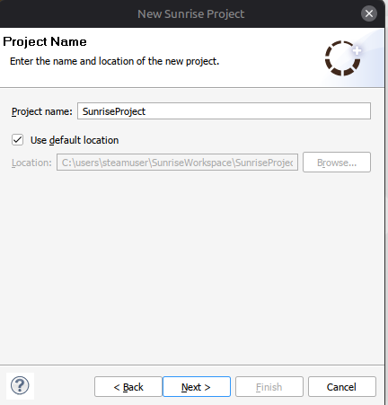
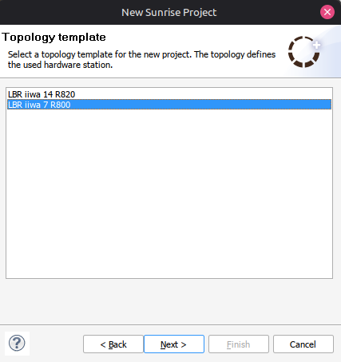
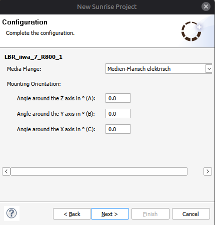
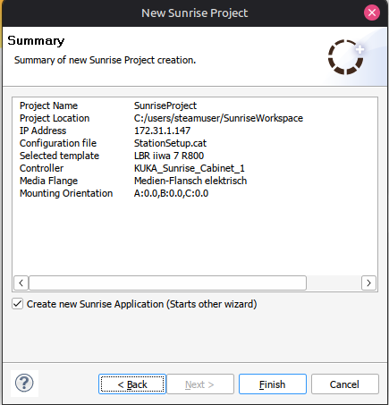
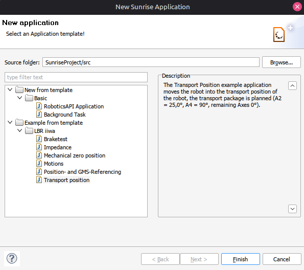
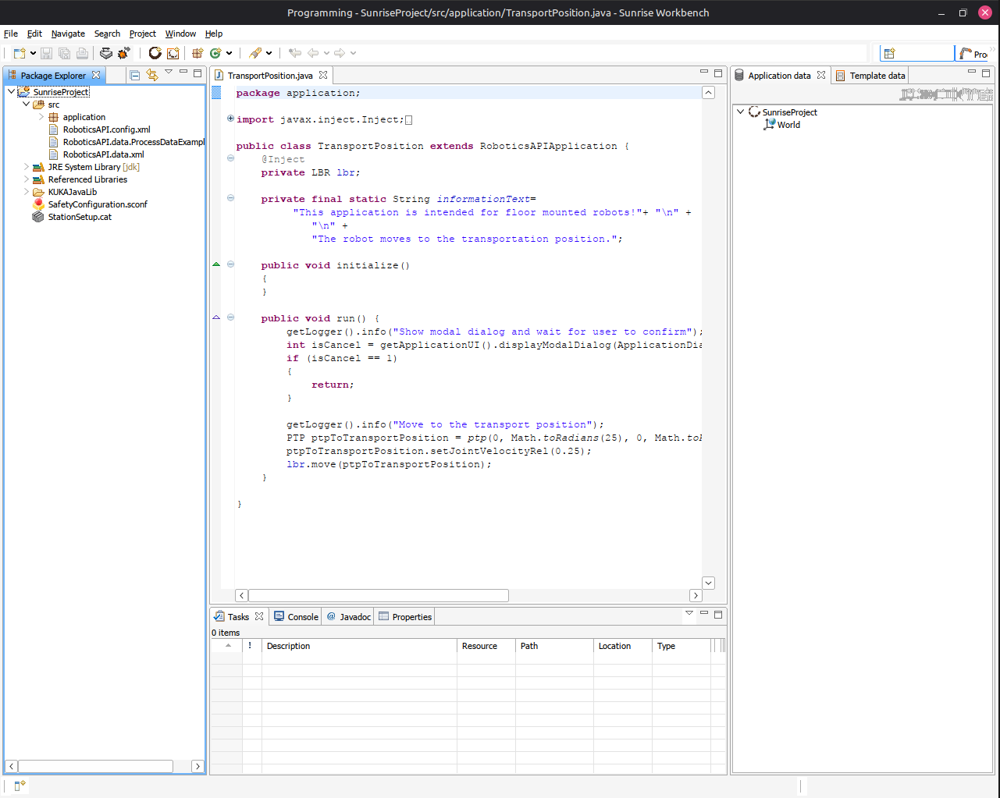

# Создание нового проекта

В данном разделе описан процесс создания нового проекта в SunriseWorkbench и его первоначальная конфигурация для работы с роботом KUKA LBR IIWA 7.

!!! note "Предварительное требование"
    Перед созданием проекта убедитесь, что SunriseWorkbench установлен. Инструкции по установке приведены в разделах [Windows](../install/windows.md) и [Linux](../install/linux/linux.md).

## Запуск мастера создания проекта

В главном окне SunriseWorkbench нажмите кнопку **New Sunrise Project**.

## Настройка подключения к контроллеру

В появившемся диалоговом окне укажите IP-адрес контроллера KUKA Sunrise Cabinet.

!!! warning "IP-адрес контроллера"
    IP-адрес контроллера по умолчанию: `172.31.1.147`. Если в вашей конфигурации используется другой адрес, обязательно измените его на актуальный.

## Название проекта

Задайте наименование проекта в соответствующем поле.

## Выбор модели робота

В выпадающем списке выберите модель робота. Для KUKA LBR IIWA 7 выберите **LBR iiwa 7 R800**.

## Выбор фланца

Выберите тип фланца в соответствии с конфигурацией вашего робота.

!!! warning "Выбор фланца"
    Тип фланца должен точно соответствовать физической конфигурации робота. В данной конфигурации используется **Medien-Flansch elektrisch**. Ориентацию оставьте по умолчанию (0°).

## Проверка конфигурации

В итоговом окне проверьте все указанные параметры. Убедившись в их корректности, нажмите **Finish**.

## Выбор шаблона приложения

После создания проекта откроется диалог выбора шаблона. Выберите один из предложенных примеров и нажмите **Finish**.

## Главное окно редактора

После успешного завершения мастера откроется основное окно редактора SunriseWorkbench с созданным проектом.

!!! tip "Следующий шаг"
    Для полноценной работы с роботом необходимо установить все требуемые библиотеки. Инструкции приведены в разделе [Установка библиотек](libraries.md).
