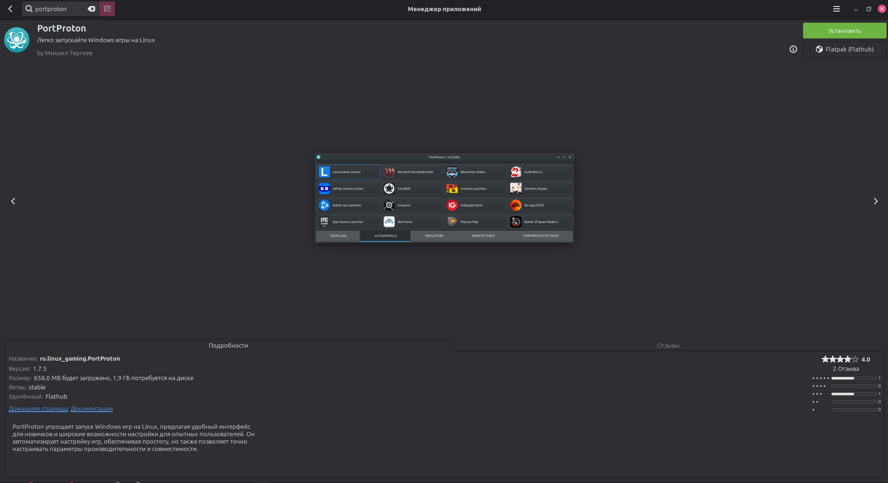
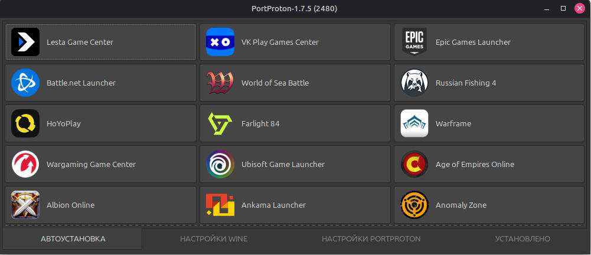
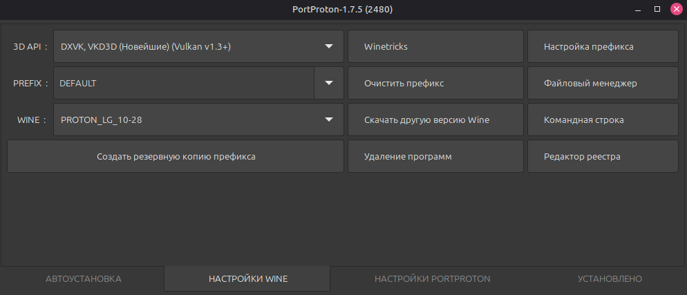

# Установка эмулятора Windows

Для запуска Windows-приложений на Linux используется эмулятор **PortProton**, устанавливаемый через пакетный менеджер **Flatpak** из репозитория **Flathub**.

## Установка Flatpak

Для Ubuntu 18.10 и более поздних версий выполните:

```bash
sudo apt install flatpak
```



## Установка плагина для GNOME Software

Для поддержки Flatpak-пакетов в Центре приложений GNOME:

```bash
sudo apt install gnome-software-plugin-flatpak
```

## Подключение репозитория Flathub

```bash
flatpak remote-add --if-not-exists flathub https://dl.flathub.org/repo/flathub.flatpakrepo
```


!!! warning "Перезагрузка"
    После добавления репозитория необходимо перезагрузить систему для применения изменений.

## Установка PortProton

**Через терминал:**

```bash
flatpak install flathub ru.linux_gaming.PortProton
```



**Запуск:**

```bash
flatpak run ru.linux_gaming.PortProton
```

Также PortProton доступен в Центре приложений GNOME после подключения Flathub.

## Первоначальная настройка

При первом запуске PortProton автоматически устанавливает необходимые зависимости Wine и вспомогательные компоненты. Процесс занимает несколько минут.



После завершения инициализации станут доступны основные функции приложения, в том числе:

- **Настройки Wine** — управление конфигурацией Wine-окружения;
- **Командная строка Windows** — запуск cmd.exe внутри Wine;
- **Файловый менеджер** — доступ к виртуальной файловой системе Windows.

!!! tip "Следующий шаг"
    После установки PortProton перейдите к разделу [Установка SunriseWorkbench](workbench.md).
