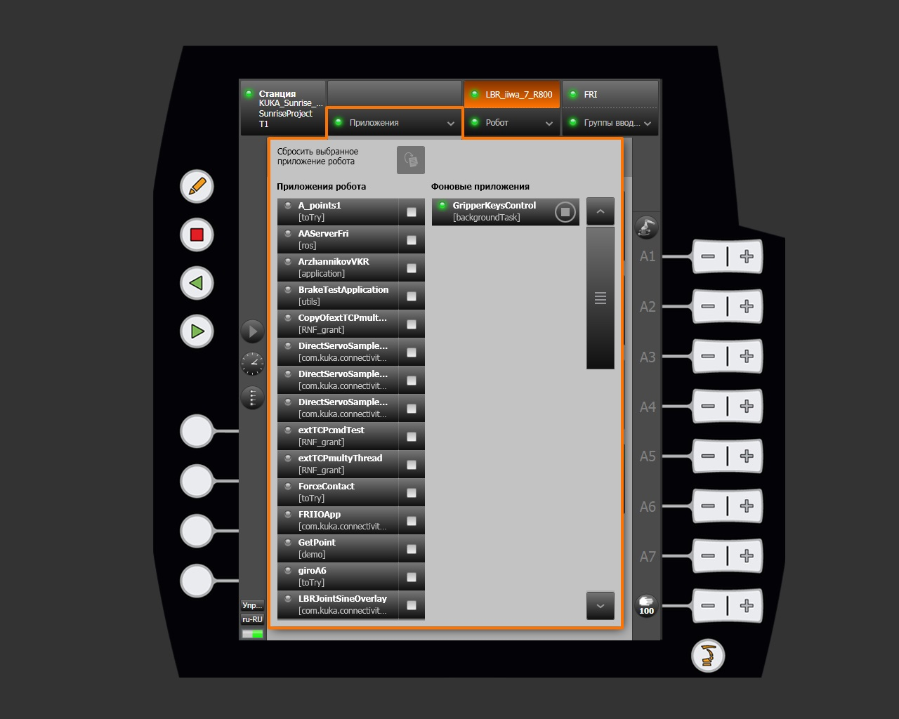
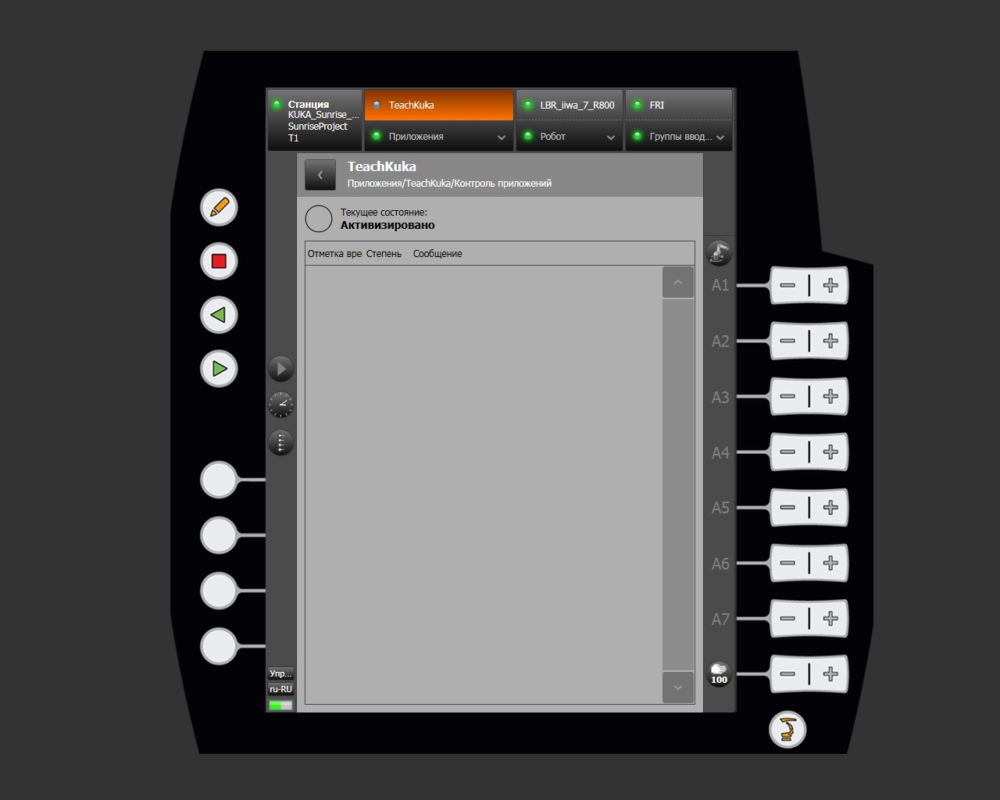
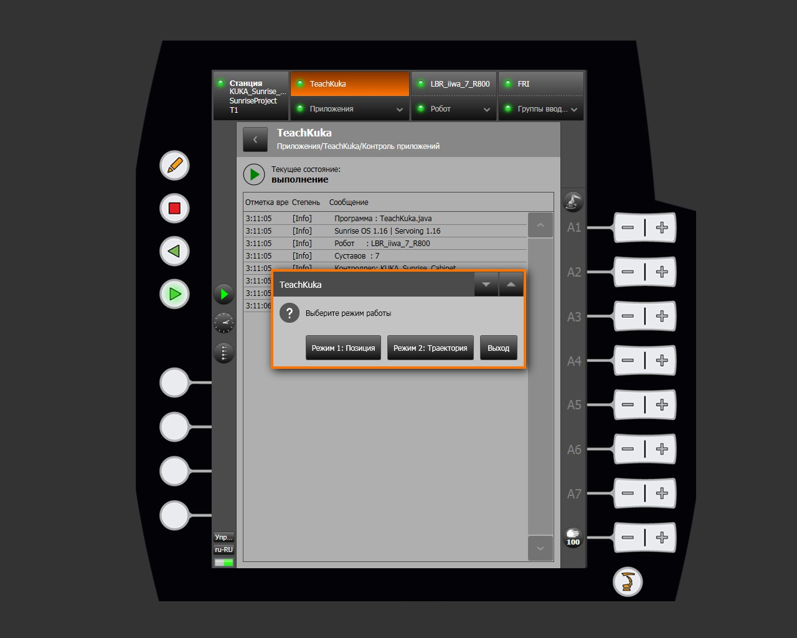
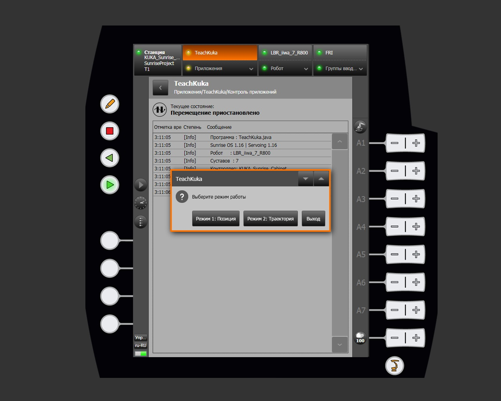
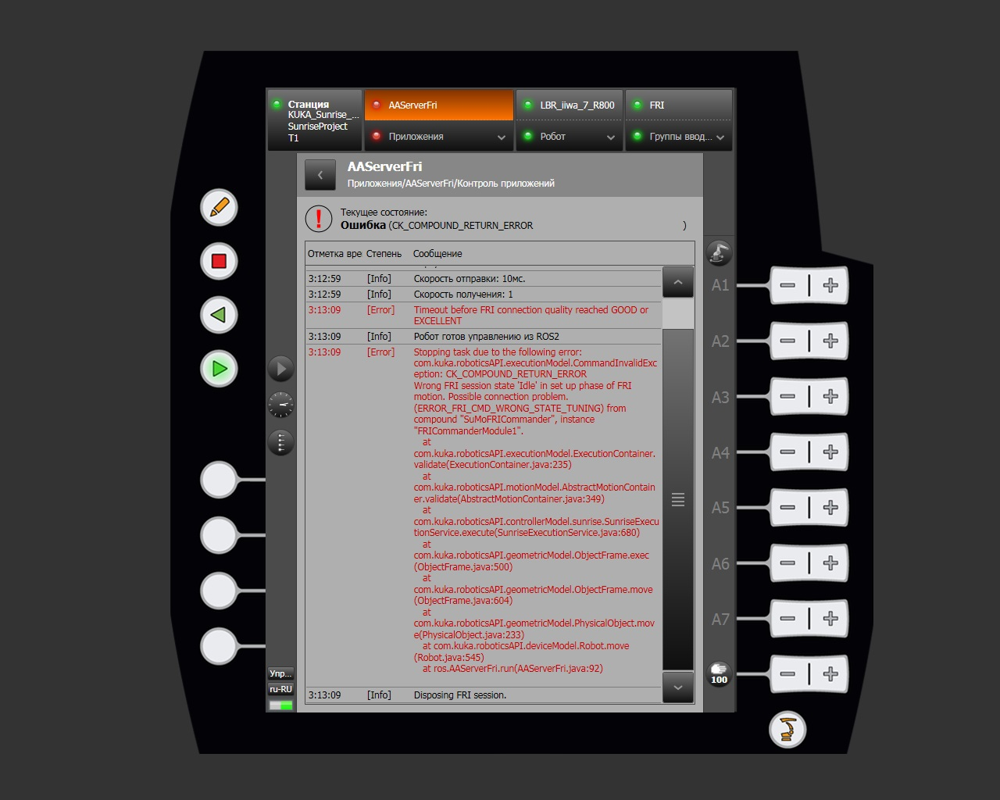
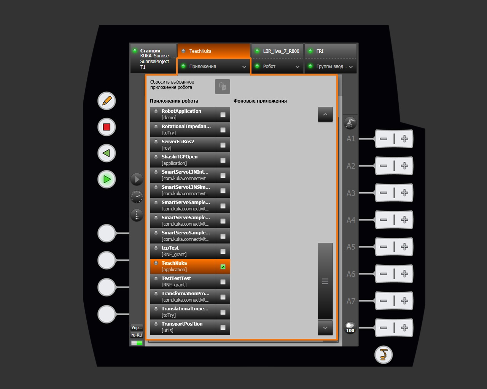

# Приложения

Раздел **Приложения** предоставляет доступ к выбору и управлению управляющими программами, разработанными в SunriseWorkbench и развёрнутыми на контроллере. Раздел открывается через кнопку **Приложения** в строке навигации smartHMI.

## Список приложений

Страница выбора приложений разделена на два столбца:

| Столбец | Описание |
|---|---|
| Приложения робота | Управляющие программы, запускаемые вручную оператором. |
| Фоновые приложения | Программы, выполняющиеся автоматически (`backgroundTask`). |

Каждая запись в списке содержит:

- **Индикатор состояния** — цветная точка слева от наименования.
- **Наименование приложения** — имя класса Java.
- **Пакет** — пространство имён или категория (например, `[application]`, `[ros]`, `[demo]`).
- **Чекбокс** — для выбора или деактивации приложения.

Кнопка **Сбросить выбранное приложение робота** (иконка руки) снимает выбор активного приложения без его остановки. Фоновые приложения, находящиеся в состоянии выполнения, отображаются с зелёной точкой и кнопкой **Стоп**.

## Выбор и активация приложения

Для выбора приложения нажмите на его наименование в списке. Выбранное приложение выделяется оранжевым цветом, в чекбоксе появляется галочка (✓), а наименование отображается в строке навигации smartHMI. Система автоматически открывает страницу **Контроль приложений** с текущим состоянием программы и журналом её выполнения.

## Состояния приложения

### Активизировано

Серый круглый индикатор — приложение выбрано и загружено в контроллер, однако ещё не запущено.

### Выполнение

Зелёный индикатор воспроизведения — программа активно выполняется. В журнале в реальном времени отображаются события, определённые программистом. Если программа предусматривает взаимодействие с оператором, поверх журнала появляется диалог с кнопками выбора.

### Перемещение приостановлено

Жёлтый индикатор паузы — выполнение прервано. Для возобновления продолжите выполнение программы, по тому же принципу как и запускали приложение.

### Ошибка

Красный индикатор — в ходе выполнения возникло необработанное исключение. Строка состояния отображает код ошибки. Исправление логических ошибок выполняется в SunriseWorkbench.

## Деактивация приложения

Для снятия выбора с приложения перейдите в раздел **Приложения**, найдите активное приложение (выделено оранжевым, чекбокс ✓) и нажмите на чекбокс — приложение будет деактивировано.

