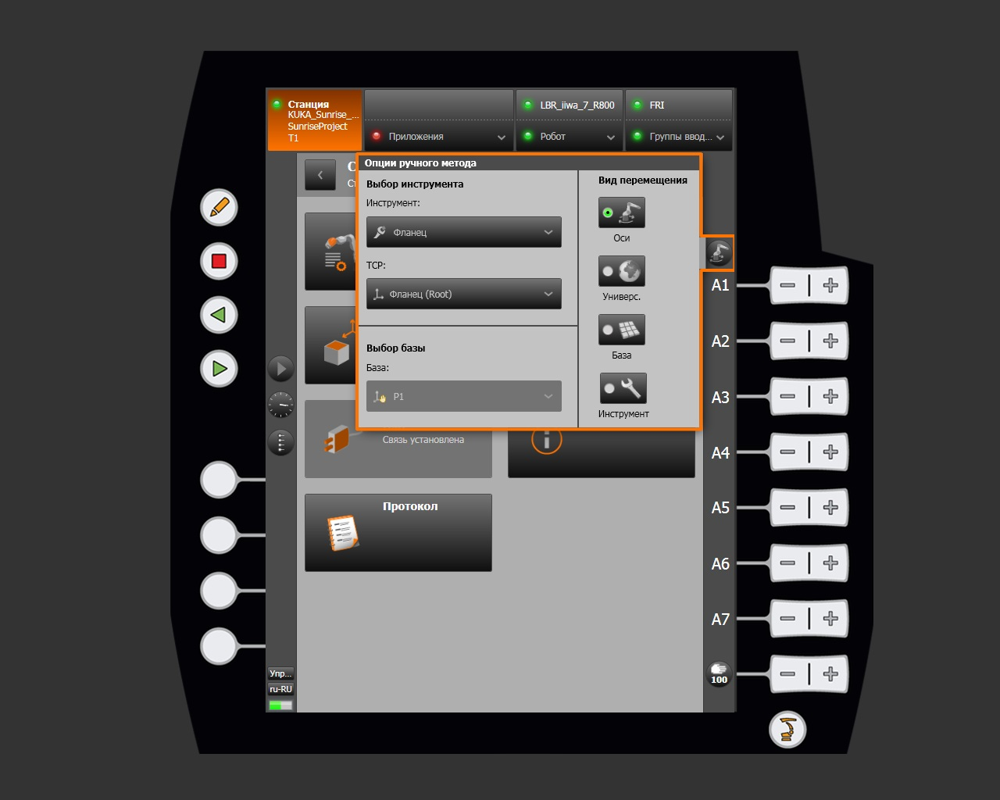
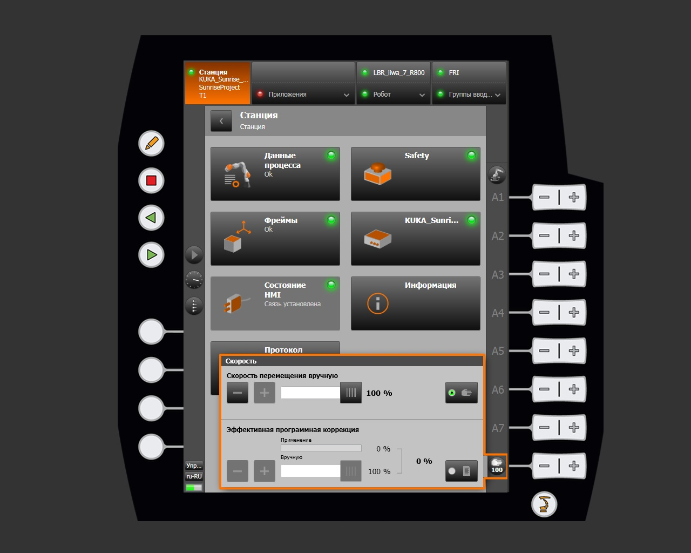
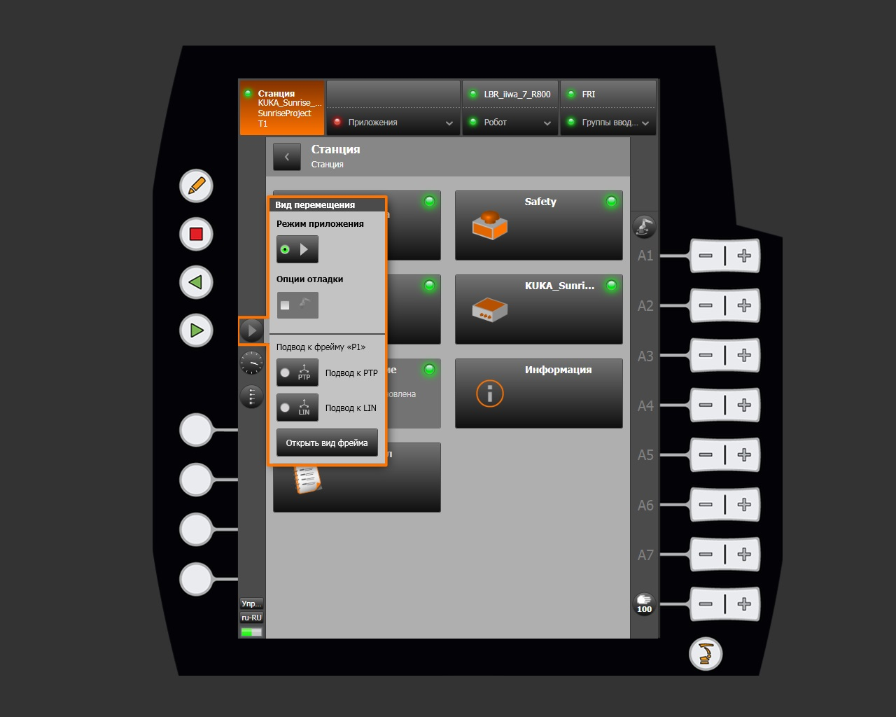
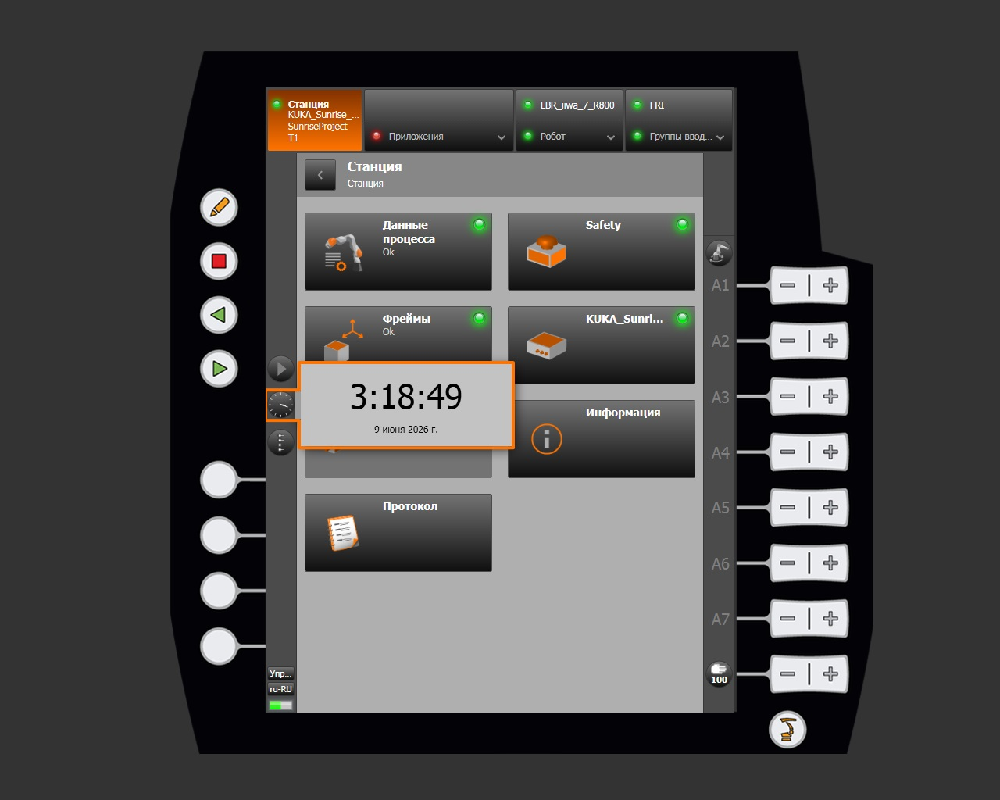
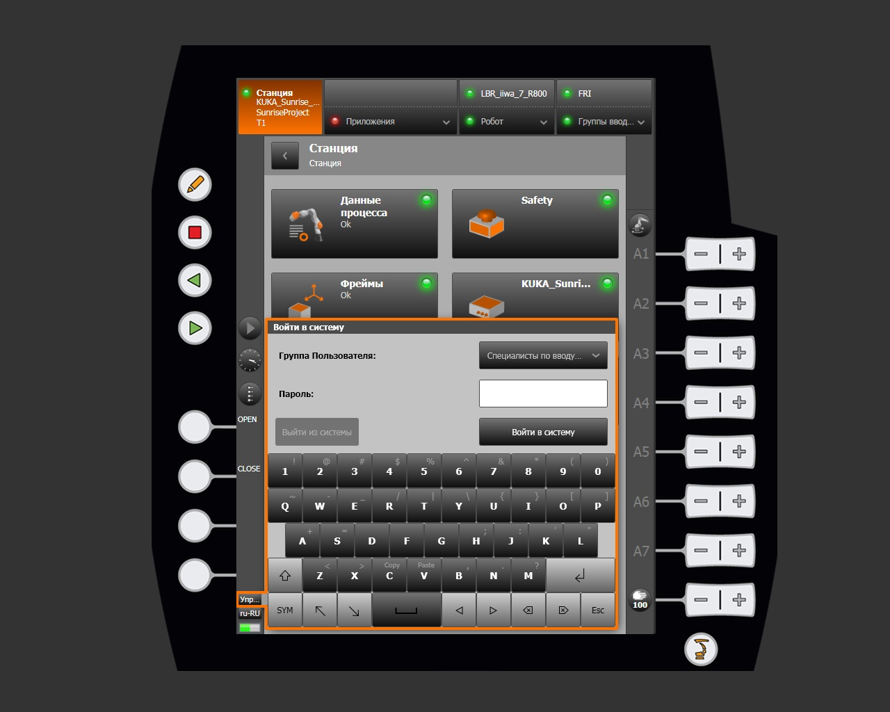
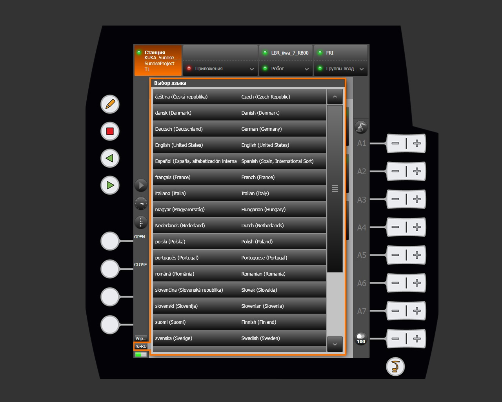

# Extra menu

In addition to the main functional areas under [Station](station.md), smartHMI provides additional robot control parameters through the smartPAD side panel. These panels open over the current view without navigating to another section.

## Manual control method

The **Manual method options** panel configures manual motion: the active tool, control point (TCP), base coordinate system, and motion frame.

### Selecting the tool and TCP

| Parameter | Description |
|---|---|
| Tool | Active tool attached to the flange. Default: `Flange` |
| TCP | Tool control point. Default: `Flange (Root)` |

### Selecting the base

The base coordinate system relative to which manual motion is performed. Select it from the frames defined in the project, for example `P1`.

### Motion frame

Determines the coordinate system used by the A1–A7 axis buttons:

| Mode | Description |
|---|---|
| Axes | Joint-by-joint control. Each button moves its corresponding axis independently. |
| World | Motion in the universal (world) coordinate system. |
| Base | Motion in the selected base coordinate system. |
| Tool | Motion in the coordinate system of the active tool (TCP). |

## Control speed

The **Speed** panel sets the percentage limit for manual motion and program execution speed.

## Motion mode

The **Motion mode** panel controls how the **Start** button works and how the robot approaches frames.

### Application mode

| Mode | Description |
|---|---|
| Start — continuous | The Start button runs the application continuously (default). |
| Step execution | The Start button executes one program step at a time. Used for debugging. |

### Approaching a frame

| Type | Description |
|---|---|
| PTP approach | Motion along the shortest path in joint space (Point-to-Point). |
| LIN approach | Straight-line TCP motion in Cartesian space (Linear). |

The **Open frame view** button opens the Frames section.

## Clock

Clicking the clock icon displays the controller's current system time and date.

!!! note
    System time is synchronized with the KUKA Sunrise Cabinet controller clock. Change it in the controller operating system settings.

## User group

The **Log on** dialog changes the active user group and the corresponding HMI access level.

The access level determines which operations are available, including editing frames, managing Safety settings, and changing the project configuration.

## Changing the language

The **Language selection** dialog changes the smartHMI interface language.

The change takes effect immediately without restarting the system. The current interface locale appears in the lower-left corner of smartHMI, for example `ru-RU`.
