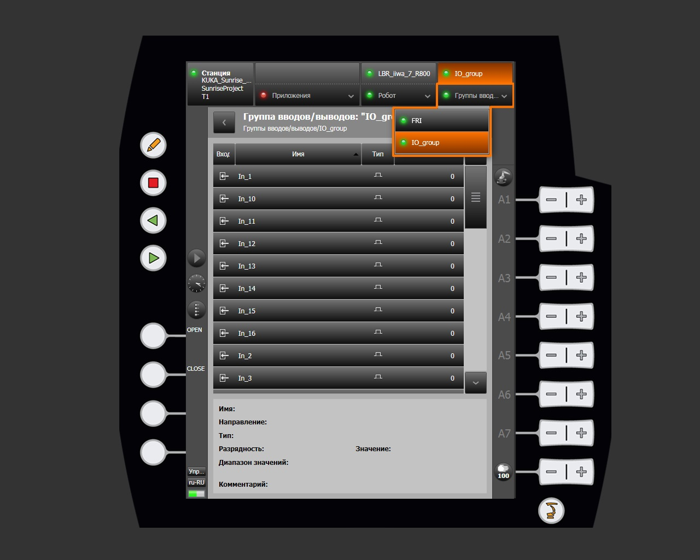
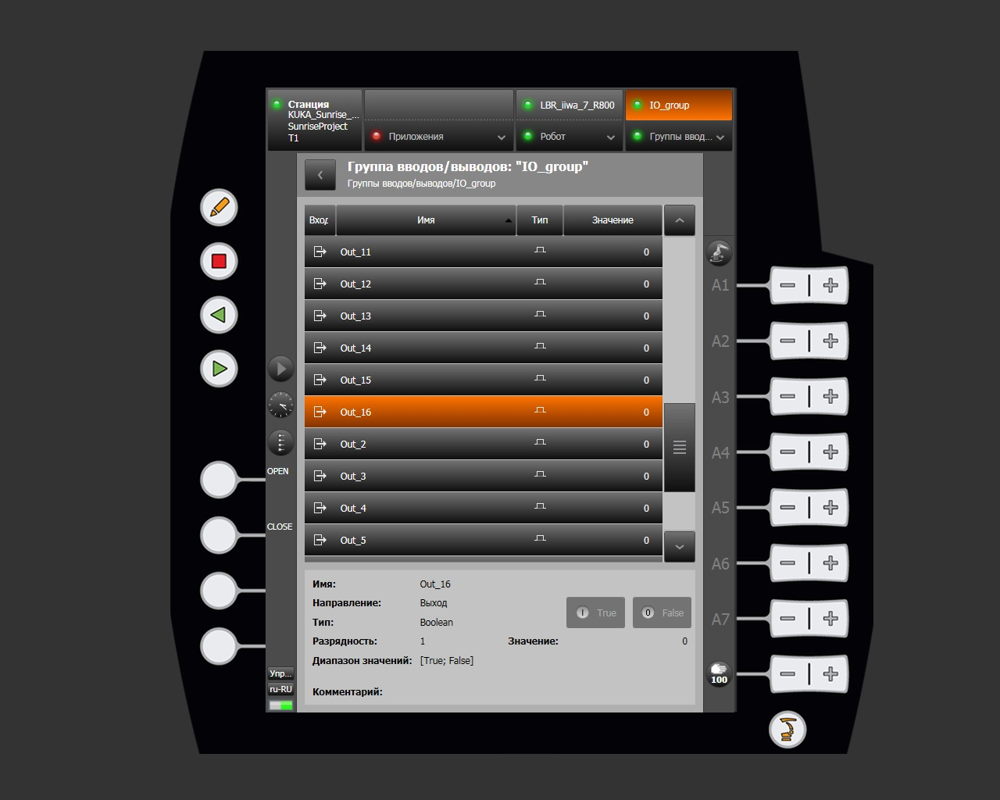

# Меню IO Group

Раздел **Группы вводов/выводов** предоставляет доступ к мониторингу и ручному управлению цифровыми сигналами ввода/вывода, сконфигурированными в проекте Sunrise. Раздел открывается через строку навигации smartHMI.

## Доступные группы

При нажатии на кнопку **Группы вводов/выводов** в строке навигации открывается список доступных групп. В данном проекте определены следующие группы:

| Группа | Описание |
|---|---|
| FRI | Группа сигналов интерфейса FRI (Fast Robot Interface) |
| IO_group | Пользовательская группа цифровых вводов/выводов |

## Просмотр сигналов

После выбора группы открывается страница со списком всех сигналов.

### Структура таблицы сигналов

| Столбец | Описание |
|---|---|
| Вход / Выход | Иконка направления сигнала |
| Имя | Наименование сигнала (например, `In_1`, `Out_16`) |
| Тип | Тип сигнала (для данной группы — цифровой Boolean) |
| Значение | Текущее состояние сигнала (`0` / `1`) |

## Управление выходными сигналами

Для сигналов с направлением **Выход** в нижней панели отображаются кнопки принудительной установки значения:

| Кнопка | Действие |
|---|---|
| True | Установить значение выходного сигнала в `1` (активен) |
| False | Установить значение выходного сигнала в `0` (неактивен) |

!!! note
    Сигналы с направлением **Вход** доступны только для чтения.
