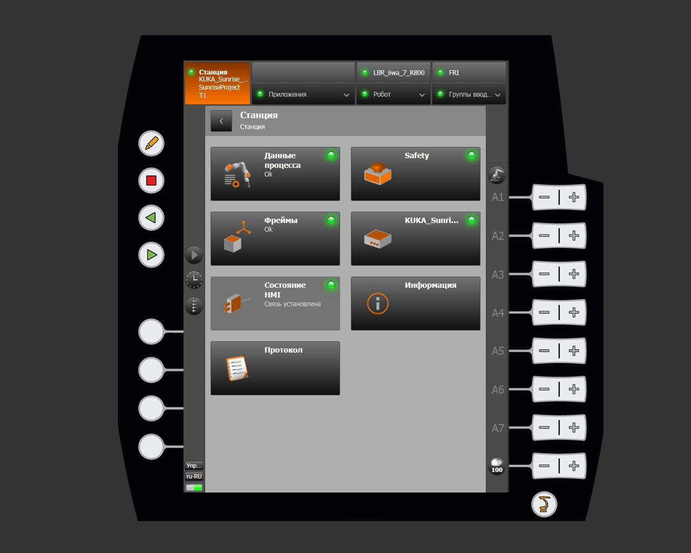
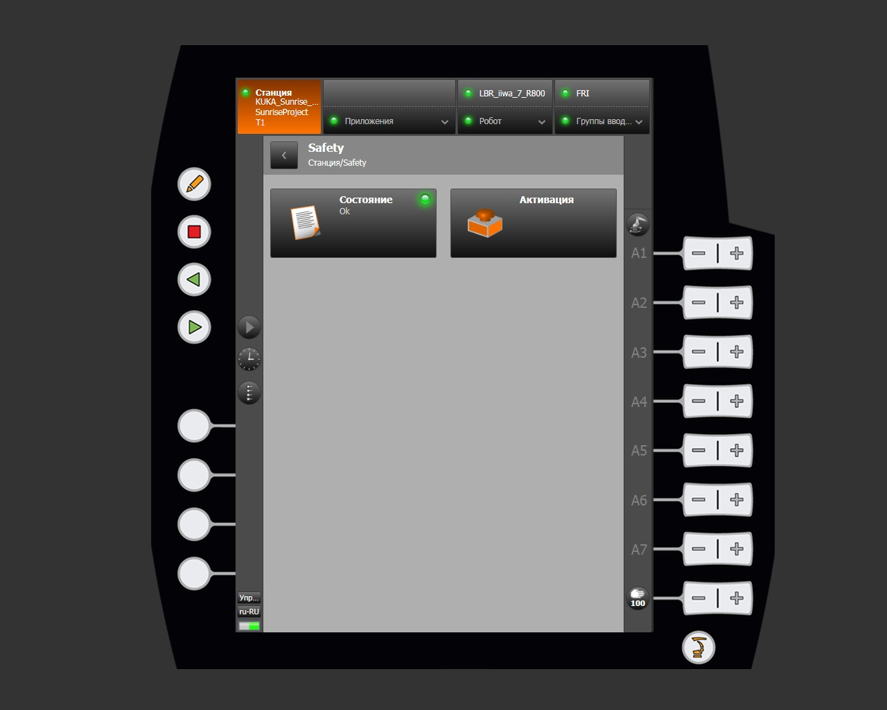
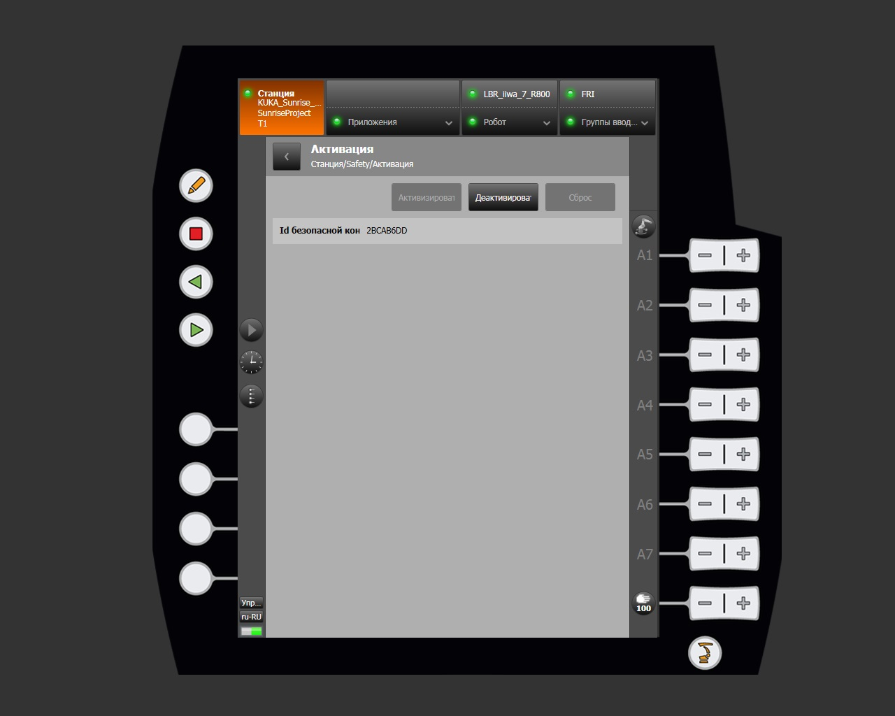
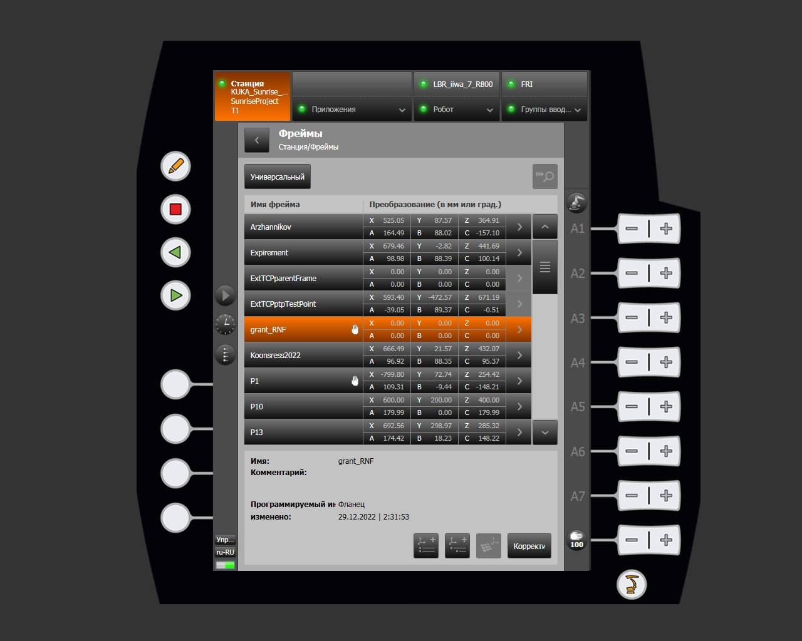
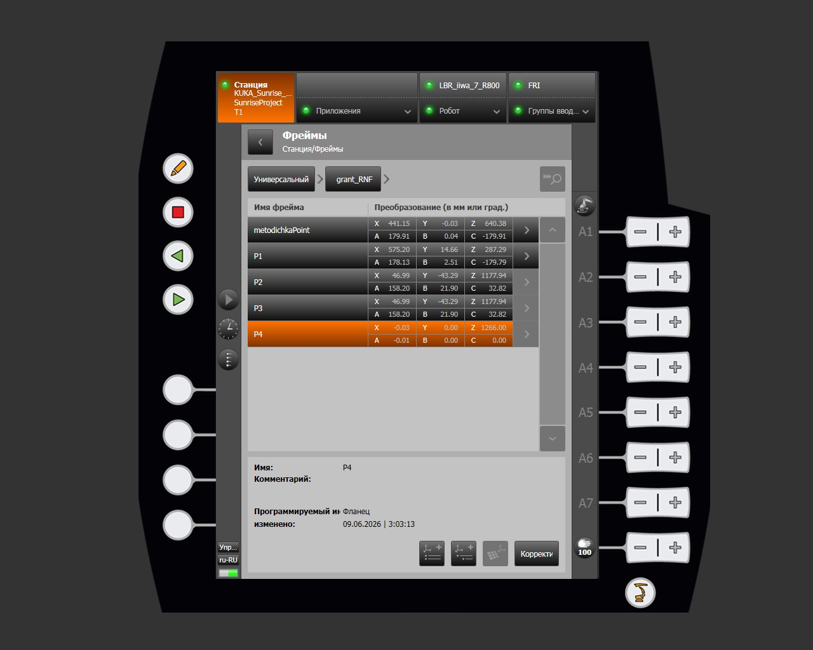
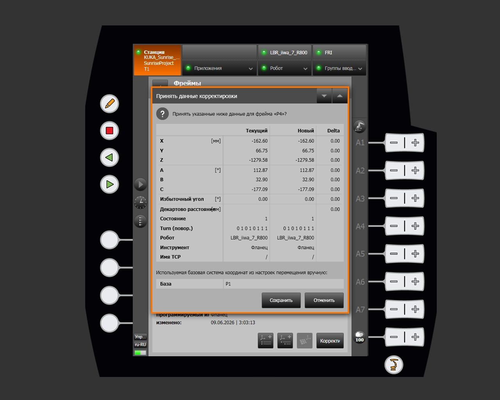
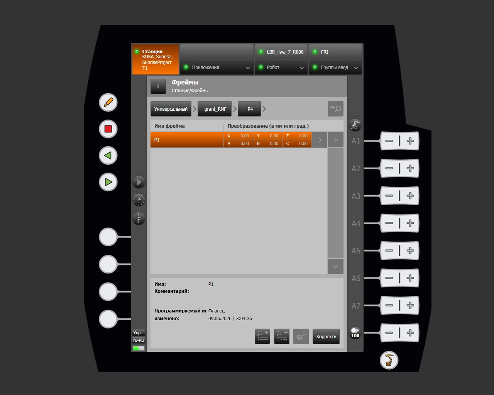
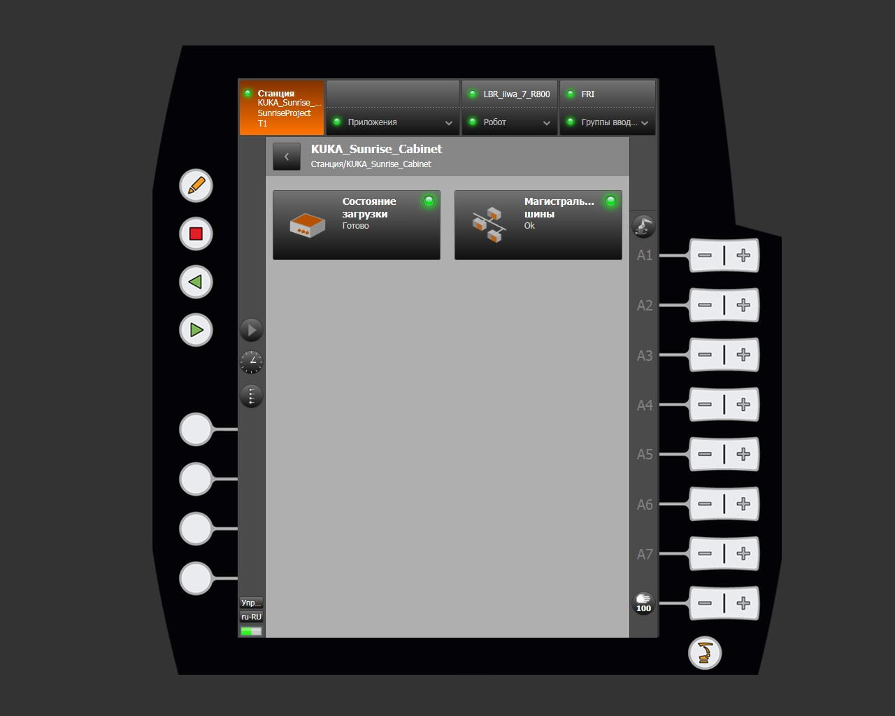
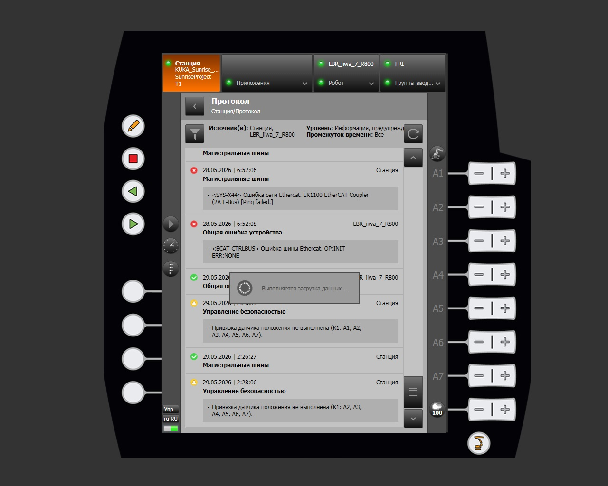
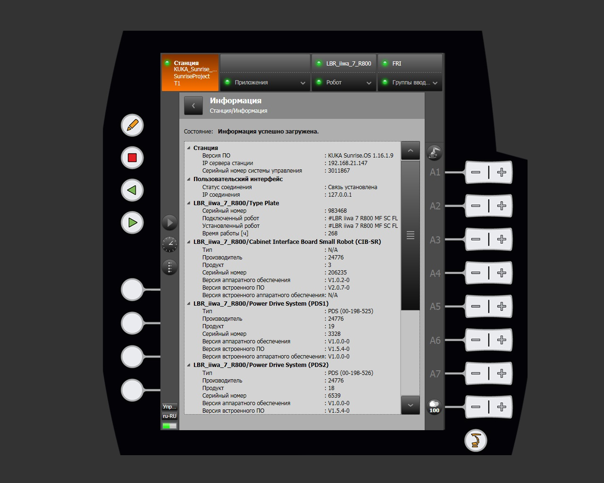

# Станция

Раздел **Станция** является главным уровнем навигации интерфейса KUKA smartHMI. Он открывается нажатием кнопки **Станция** в строке навигации smartPAD и предоставляет доступ к основным функциям управления роботизированной ячейкой.

## Структура меню

Интерфейс раздела Станция включает четыре функциональных блока:

| Блок | Описание |
|---|---|
| Меню навигации | Станция, Приложения, Меню робота, Меню IO Group |
| Меню станции | Данные процесса, Safety, Фреймы, KUKA_Sunrise_cabinet, Состояние HMI, Информация, Протокол |
| Дополнительное меню | Вид перемещения, Часы, Пользовательские кнопки |
| Функциональные кнопки smartPAD | Управление программой и перемещением |

## Данные процесса

Раздел **Данные процесса** отображает текущее состояние активного приложения (например, `Ok`). Используется для мониторинга параметров выполняемой программы в режиме реального времени.

## Safety

Раздел **Safety** предоставляет доступ к настройкам и состоянию системы безопасности робота.

### Функции блока Safety

| Функция | Описание |
|---|---|
| Состояние | Отображает текущее состояние конфигурации безопасности |
| Активация | Управление активацией и деактивацией конфигурации безопасности |

### Доступные действия на странице Активация

| Действие | Описание |
|---|---|
| Активизировать | Применить и активировать текущую конфигурацию безопасности |
| Деактивировать | Отключить активную конфигурацию безопасности |
| Сброс | Сбросить конфигурацию безопасности к предыдущему состоянию |

Поле **Id безопасной конфигурации** отображает уникальный идентификатор загруженной конфигурации (например, `2BCAB6DD`).

## Фреймы

Раздел **Фреймы** открывает редактор систем координат.

Здесь отображается список всех фреймов, определённых в проекте Sunrise, с возможностью просмотра, корректировки и навигации по иерархии.

### Структура таблицы фреймов

| Столбец | Описание |
|---|---|
| Имя фрейма | Наименование фрейма в проекте |
| X, Y, Z | Смещение по осям в мм |
| A, B, C | Ориентация в градусах |

Данные фреймов также доступны в приложении SunriseWorkbench.

### Навигация и корректировка

Для перехода в дочерние фреймы нажмите кнопку **>** рядом с нужным фреймом. Путь навигации в строке «хлебных крошек» обновляется автоматически. Для возврата на предыдущий уровень нажмите соответствующий элемент в строке навигации.

При нажатии **Корректировать** открывается диалог с таблицей сравнения текущих и новых значений. Для подтверждения нажмите **Сохранить**, для отмены — **Отменить**.

Фреймы поддерживают многоуровневую вложенность. Полный путь иерархии отображается в строке навигации (например, `Универсальный > grant_RNF > P4`).

## KUKA_Sunrise_cabinet

Раздел **KUKA_Sunrise_Cabinet** отображает информацию о состоянии аппаратных компонентов контроллера.

| Компонент | Описание |
|---|---|
| Состояние загрузки | Статус загрузки контроллера |
| Магистральные шины | Состояние шины EtherCAT |

## Состояние HMI

Раздел **Состояние HMI** отображает статус соединения между smartHMI и контроллером Sunrise Cabinet.

## Протокол

Раздел **Протокол** открывает журнал системных событий.

### Фильтры журнала

| Фильтр | Описание |
|---|---|
| Источник(и) | Станция, LBR_iiwa_7_R800 или оба |
| Уровень | Информация, Предупреждение, Ошибка |
| Промежуток времени | Временной диапазон выборки |

Каждая запись содержит: иконку уровня, дату и время события, источник, наименование и описание события.

## Информация

Раздел **Информация** содержит подробные системные сведения о контроллере и подключённом роботе.

## Функциональные кнопки smartPAD

Физические кнопки smartPAD разделены на три группы: кнопки управления программой (левая панель), кнопки ручного управления осями (правая панель) и пользовательские кнопки.

### Кнопки управления программой

| Кнопка | Описание |
|---|---|
| Редактировать | Переход в режим обучения (Teach). Активирует возможность изменения точек программы в ручном режиме. |
| Стоп | Останавливает выполнение программы или движение робота. |
| Шаг назад | Выполняет один шаг программы в обратном направлении. Используется для отладки. |
| Старт | Запускает выбранное приложение или возобновляет остановленную программу. В режиме T1/T2 требует удержания enabling device. |

!!! note
    Режим редактирования со smartPAD не используется — все программы написаны на Java и изменяются только в SunriseWorkbench.

### Кнопки управления осями (режимы T1 и T2)

| Кнопка | Описание |
|---|---|
| A1 − / A1 + | Перемещение оси 1 в отрицательном / положительном направлении |
| A2 − / A2 + | Перемещение оси 2 в отрицательном / положительном направлении |
| A3 − / A3 + | Перемещение оси 3 в отрицательном / положительном направлении |
| A4 − / A4 + | Перемещение оси 4 в отрицательном / положительном направлении |
| A5 − / A5 + | Перемещение оси 5 в отрицательном / положительном направлении |
| A6 − / A6 + | Перемещение оси 6 в отрицательном / положительном направлении |
| A7 − / A7 + | Перемещение оси 7 в отрицательном / положительном направлении |

При выборе режима декартового управления те же кнопки управляют перемещением TCP по осям X / Y / Z и ориентацией A / B / C.

### Управление скоростью (Override)

| Кнопка | Описание |
|---|---|
| 0 | Уменьшение скорости ручного перемещения |
| 100 | Увеличение скорости ручного перемещения |

Значение отображается в процентах от максимальной скорости. В режиме T1 скорость TCP аппаратно ограничена до 250 мм/с.

### Пользовательские кнопки

Четыре белые круглые кнопки в нижней части левой панели. Их назначение задаётся программно в Sunrise-проекте через API. По умолчанию не назначены.

## Режимы работы

| Режим | Описание |
|---|---|
| T1 | Ручное управление, скорость ограничена до 250 мм/с по TCP. Требуется удержание enabling device. |
| T2 | Ручное управление, нормальная скорость. Требуется удержание enabling device. |
| AUT | Автоматический режим. Кнопки осей недоступны, управление осуществляется кнопками Старт / Стоп. |

!!! tip "Дополнительное меню"
    Описание дополнительных параметров управления приведено в разделе [Дополнительное меню](extra-menu.md).
