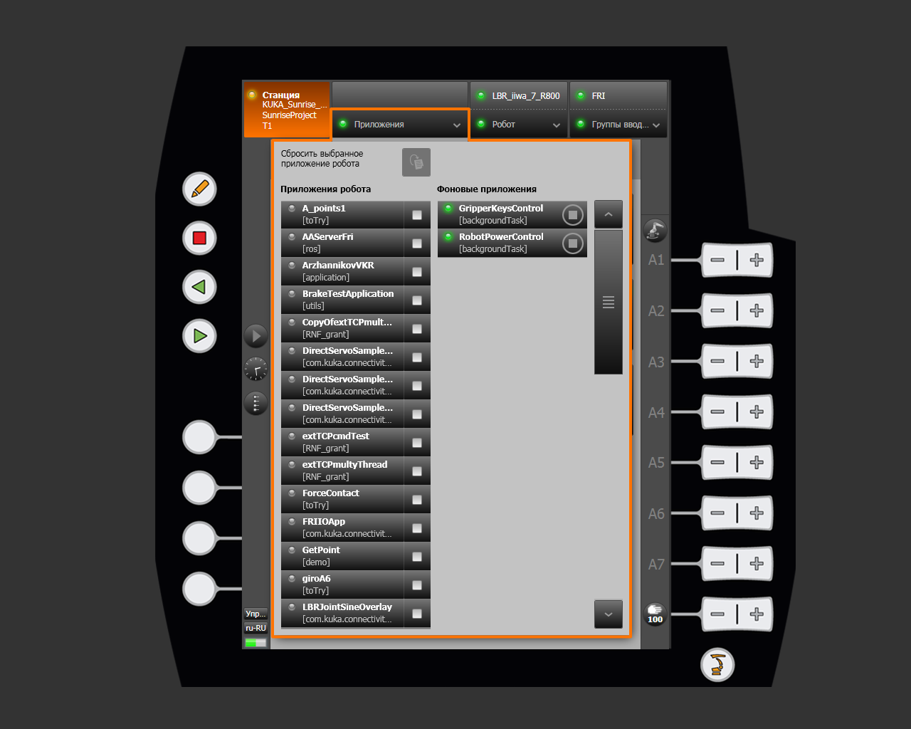
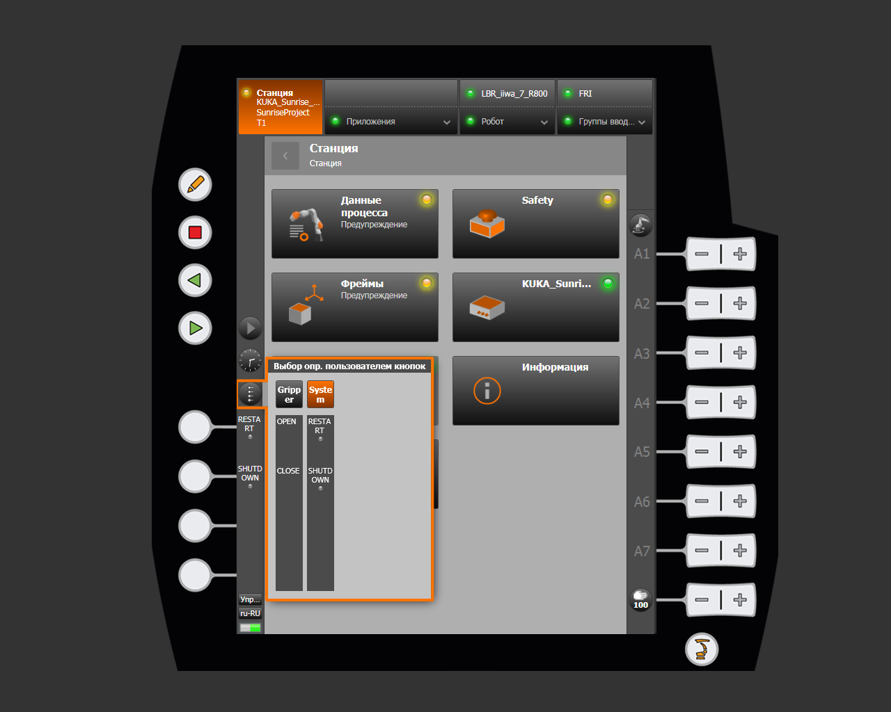
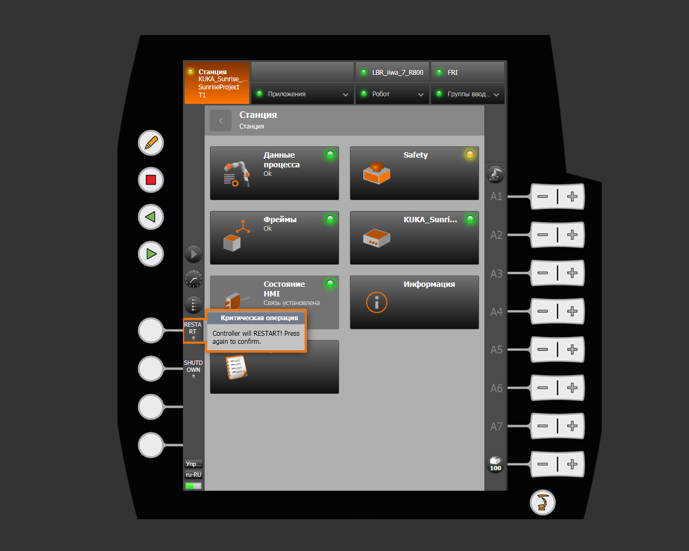

# RobotPowerControl

**RobotPowerControl** is a SunriseWorkbench background task for safely shutting down or quickly restarting the KUKA Sunrise Cabinet controller from the smartPAD. When the task starts, a **System** panel appears on the smartPAD with two user buttons: **REBOOT** and **SHUTDOWN**.

This is particularly useful when the controller battery is faulty, because pressing the physical power button may cause an abrupt shutdown. The task lets you shut down the controller correctly or restart it without going to the control cabinet.

!!! warning "Before shutdown or restart"
    Stop robot motion and make sure that the operation is safe for the entire robot cell. These buttons control power to the **controller**. After confirmation, the robot connection and running applications are interrupted.

## Source code

The Java task class is located at [`src/iiwa_sunrise/src/RobotPowerControl.java`](https://github.com/Daniel-Robotic/lightweight-cobot/blob/dev/src/iiwa_sunrise/src/RobotPowerControl.java). Open or download it from this link to add it to a Sunrise project.

The shutdown and restart scripts are already installed on the controller. The task calls them through `cmd.exe` at `D:\Programme\reboot.cmd` and `D:\Programme\shutdown.cmd`.

## Starting the task

`RobotPowerControl` runs as a background application (`backgroundTask`). See [smartHMI Applications](../features/applications.md) for details.

The screenshot shows `RobotPowerControl` in the **Background applications** list with a green status indicator.

## Using the smartPAD buttons

| Button | Action |
|---|---|
| **REBOOT** | Runs `reboot.cmd` and restarts the controller |
| **SHUTDOWN** | Runs `shutdown.cmd` and safely shuts down the controller |

Open the user buttons from the smartPAD side menu. See [smartPAD function buttons](../features/station.md#smartpad-function-buttons) for details. The **System** panel contains the **REBOOT** and **SHUTDOWN** buttons.

Each button requires confirmation to prevent accidental activation:

1. Press **REBOOT** or **SHUTDOWN**. smartHMI displays a warning about the critical operation.
2. Press the button again in the confirmation dialog only if you intend to perform the selected action.
3. The corresponding script starts. The button indicator briefly turns yellow. If the script cannot be started, it turns red for two seconds and then returns to gray.

The image shows the dialog displayed after the first press. Press the button again to start the operation.

The task hands the script to the operating system and does not wait for it to finish. The controller begins shutdown or restart independently. If the indicator turns red, ask the controller administrator to check the system scripts.
