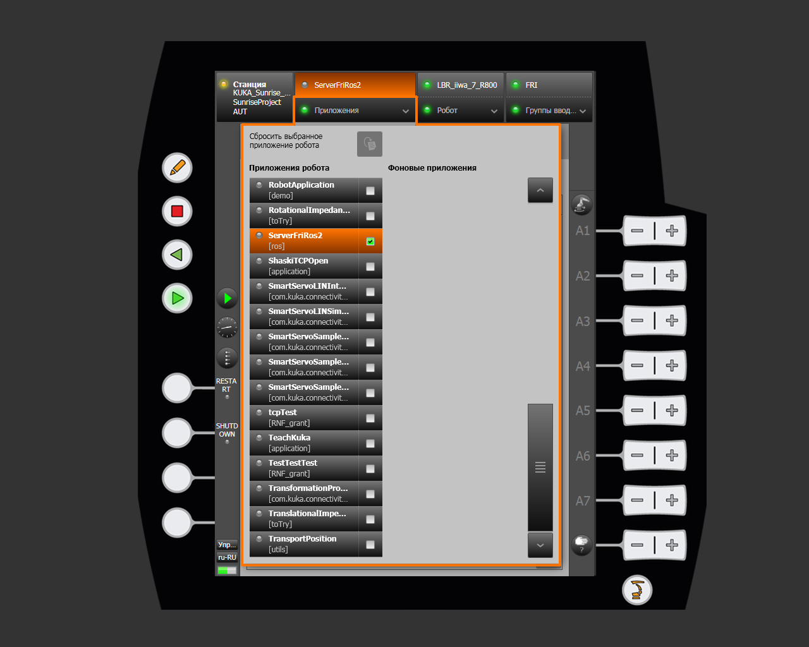
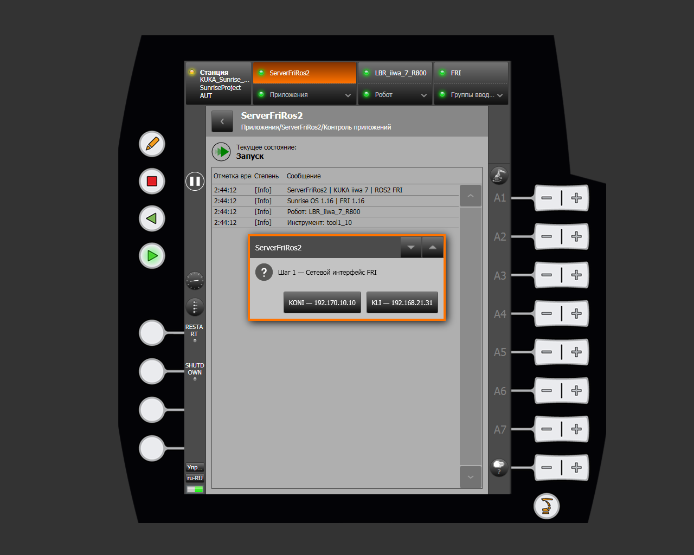
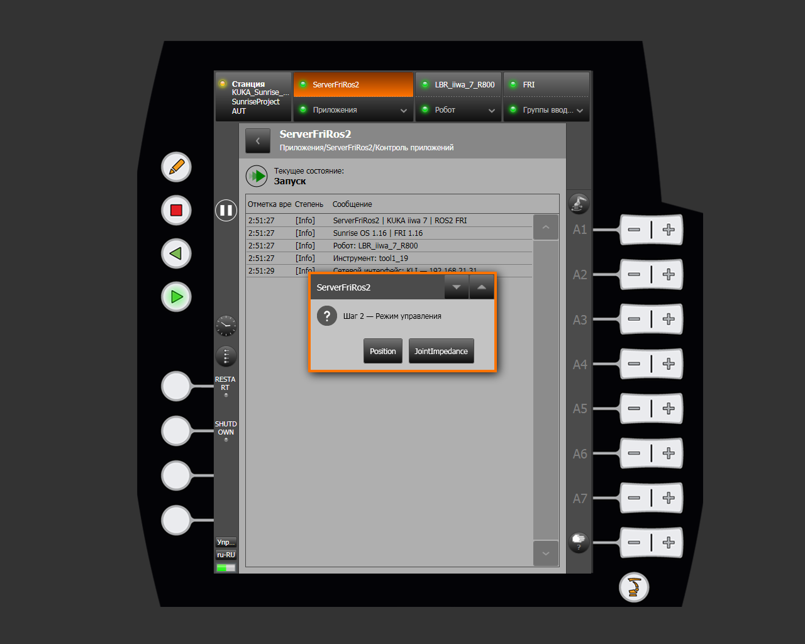
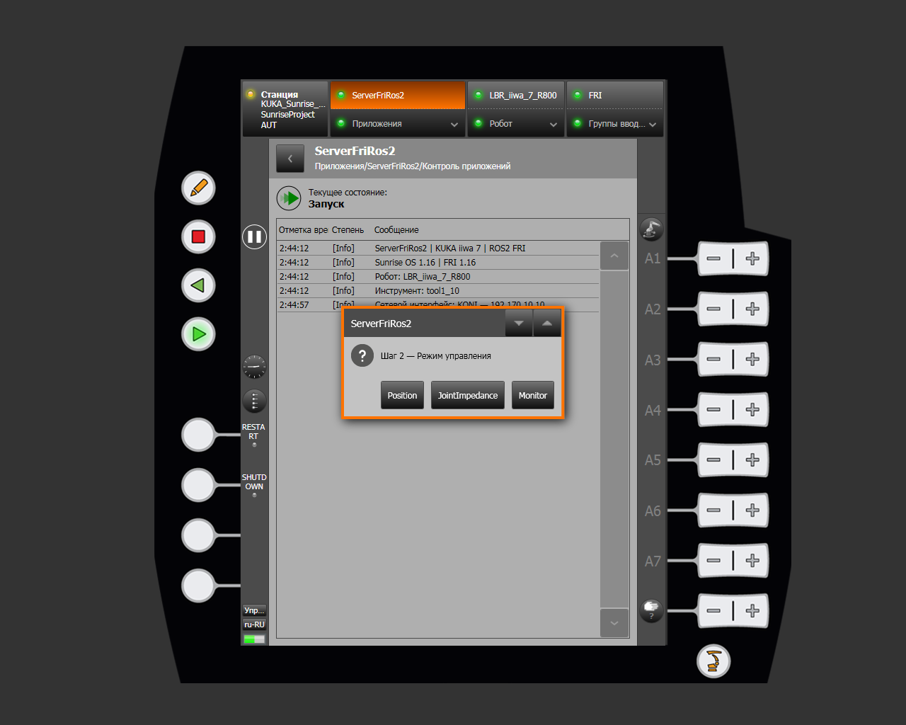
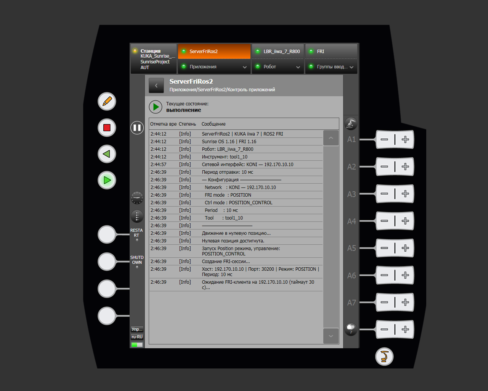
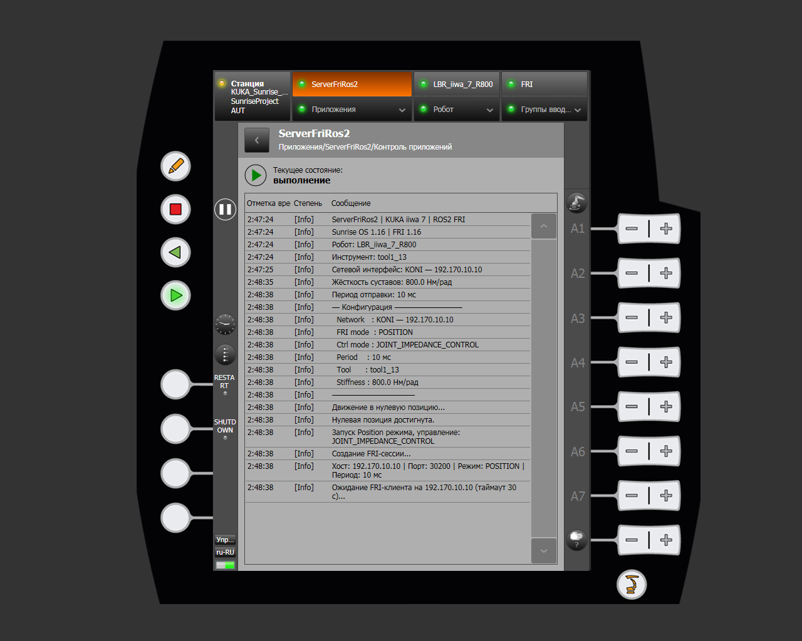
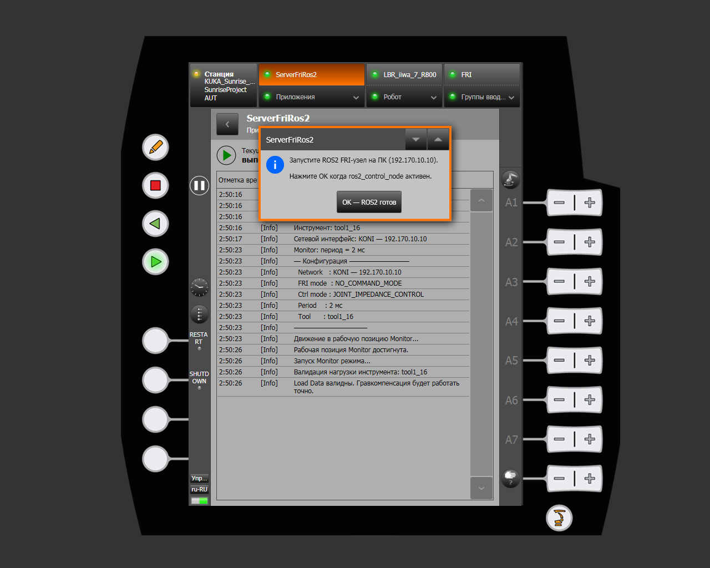

# ServerFriRos2

**ServerFriRos2** is a KUKA Sunrise Cabinet controller program that creates an FRI connection between the KUKA LBR iiwa and a ROS 2 computer. Through this connection, `ros2_control` receives the current robot state and, depending on the selected mode, sends motion commands to the controller.

The program connects the two parts of the system: the KUKA controller application and the ROS 2 control node on the external computer. A physical robot cannot be controlled through ROS 2 unless `ServerFriRos2` is running.

The program has been tested on a KUKA LBR iiwa 7 R800 with Sunrise OS 1.16 and FRI 1.16. The source code is located at [`src/iiwa_sunrise/src/ServerFriRos2.java`](https://github.com/Daniel-Robotic/lightweight-cobot/blob/dev/src/iiwa_sunrise/src/ServerFriRos2.java).

See [FRI protocol](../../../getting-started/concepts/fri-protocol.md) for an overview of the communication channel and [SunriseWorkbench setup](../../../getting-started/sunrise-setup.md) for cabling and Sunrise project preparation.

!!! warning "Before starting"
    Verify that the configured initial positions are safe for the installed tool and robot cell. Keep the workspace clear during automatic motion. Impedance and manual-guidance modes do not replace standard KUKA safety functions.

## Required configuration

Before synchronizing the project with the controller, open `ServerFriRos2.java` in Sunrise Workbench and check the parameters for your setup.

### Network addresses

The Java class contains addresses of the **ROS 2 computer** as seen through each controller interface:

```java
private static final String KONI_IP = "192.170.10.10";
private static final String KLI_IP  = "192.168.21.31";
```

Do not confuse these with `robot.ip` in `cobot-setting.yaml`. That parameter is the address of the **KUKA controller** accessed by the ROS 2 computer. See [System configuration](../../../getting-started/configuration.md) for details.

### Tool and load data

The program attaches the tool named in the `@Named` annotation to the flange:

```java
@Named("tool1")
private Tool _tool;
```

Replace `tool1` with the tool name from **Sunrise Workbench → Object Templates**. In Monitor mode, **Load Data** must contain the mass, center of mass, and inertia tensor. Before enabling gravity compensation, the program checks these parameters and warns the operator if the load model is invalid.

See [Load data](../features/robot-menu.md#load-data) for calibration and verification instructions.

### Initial positions

Before FRI starts, the robot automatically moves to one of the configured joint positions:

```java
private static final double[] ZERO_POSITION =
    {0, 0, 0, 0, 0, 0, 0};

private static final double[] MONITOR_WORKING_POSITION =
    {0, 0, 0, -1.57, 0, 1.57, 0};
```

`ZERO_POSITION` is used in Position and JointImpedance modes. In Monitor mode, the robot first passes through the zero position and then moves to `MONITOR_WORKING_POSITION`. If necessary, change these arrays to prevent collisions with fixtures, the table, or the installed tool.

### FRI period

For Position and JointImpedance, the value selected on the smartPAD must match `robot.fri_cycle_ms` in `cobot-setting.yaml`:

| Selected period | Update rate | When to use it |
|---|---:|---|
| 10 ms | 100 Hz | Standard and most stable option; required for KLI |
| 5 ms | 200 Hz | Higher-rate control through the dedicated KONI interface |

Monitor uses a fixed 2 ms period and does not display a separate period-selection dialog.

## Starting the application

Open [Applications](../features/applications.md) on the smartPAD, find `ServerFriRos2` in the robot application list, and activate it. The program then appears in the top smartHMI bar.



Press the green **Start** button on the smartPAD. The program prompts you to select a network interface, control mode, and any additional FRI parameters required by that mode.

## Step 1: selecting the network interface

The first dialog displays the configured ROS 2 computer addresses. Select the interface to which the control computer is physically connected.



| Interface | Characteristics | Available modes | Period |
|---|---|---|---|
| **KONI (X66)** | Dedicated FRI network; recommended | Position, JointImpedance, Monitor | 5 or 10 ms; Monitor: 2 ms |
| **KLI (X6)** | Shared control network; fallback option | Position, JointImpedance | 10 ms only |

KONI is better suited to real-time control because its dedicated channel provides lower latency and a more stable cycle. Use KLI when KONI is unavailable. Monitor mode is disabled over KLI because of shared-network latency.

## Step 2: selecting the control mode

Available buttons depend on the selected network interface.

Over KLI, only Position and JointImpedance are available:



Over KONI, Monitor is also available:



### Position

Position is the primary mode for ordinary ROS 2 control, including MoveIt trajectory execution. The controller follows position commands precisely; joint stiffness cannot be adjusted in this mode.

After the parameters are selected, the robot moves to `ZERO_POSITION`, creates an FRI session in `POSITION` command mode, and waits for the ROS 2 client.



### JointImpedance

JointImpedance also receives position commands from ROS 2, but executes them with configured joint stiffness. Use this mode to control mechanical impedance while following a target trajectory.

After selecting the mode, the program asks for one stiffness value for all seven joints:


| Stiffness | Robot behavior |
|---:|---|
| 1500 Nm/rad | Stiffest command tracking among the available options |
| 1000 Nm/rad | High joint stiffness |
| 800 Nm/rad | Medium joint stiffness |
| 500 Nm/rad | Softest behavior among the available options |

The program sets damping to 0.7 for every joint. After configuration, the robot moves to `ZERO_POSITION` and waits for an FRI client as in Position mode.



### Monitor

Monitor is intended for manual guidance while transmitting the current robot state to ROS 2. The computer sends no motion commands: the FRI session uses `NO_COMMAND_MODE`, and the controller transmits joint positions and torques every 2 ms.

Before connecting, the robot moves through `ZERO_POSITION` to `MONITOR_WORKING_POSITION`. The program then checks the tool Load Data and enables joint impedance with zero stiffness and damping of 0.7. Gravity compensation allows the robot to be guided carefully by hand.

Start the ROS 2 node on the computer before confirming the dialog. Press **OK — ROS2 ready** only after `ros2_control_node` is active.



!!! danger "Monitor and the load model"
    Do not enable manual guidance with invalid tool parameters. Incorrect mass, center of mass, or inertia makes gravity compensation inaccurate: the robot may resist the operator or drift unexpectedly.

## Step 3: selecting the send period

For Position or JointImpedance over KONI, the program offers a 10 or 5 ms period. Over KLI, this step is skipped because the period is fixed at 10 ms.


Start with 10 ms unless the task requires a higher control rate. Use 5 ms over KONI only for tasks that need a 200 Hz cycle.

## Connecting ROS 2

Start the physical-robot stack on the ROS 2 computer:

```bash
cobot run
```

Select the physical robot when prompted. The command starts `ros2_control_node`, the FRI hardware interface, controllers, MoveIt, and configured additional services. See [cobot CLI commands](../../../getting-started/cli-reference.md) and [Control via ROS 2](../../../getting-started/control/ros2-control.md).

For the most reliable startup, run `cobot run` on the computer first and then start `ServerFriRos2` on the smartPAD. If the KUKA application is already waiting for a client, ROS 2 must start within 30 seconds. After the timeout, the program closes the FRI session and reports an error in the log.

After connection, the smartHMI log displays:

- FRI session state;
- connection quality;
- `latency`;
- packet delivery time variation (`jitter`).

When the FRI client stops, the session closes, the active mode ends, and connection resources are released. Start the smartPAD application again for a new connection.

## If the connection cannot be established

Check the following first:

1. The selected interface is the one connected to the ROS 2 computer.
2. `KONI_IP` or `KLI_IP` matches the computer address on the selected network.
3. `cobot-setting.yaml` contains the KUKA controller address, not the computer address.
4. The 5/10 ms period in the Java program matches `robot.fri_cycle_ms`.
5. `ros2_control_node` starts before the 30-second timeout expires.
6. FRI UDP port `30200` is configured and not blocked by a firewall.

If the application cannot start because the tool or frame configuration was lost, see [Configuration error](../../../troubleshooting/config-error.md).
