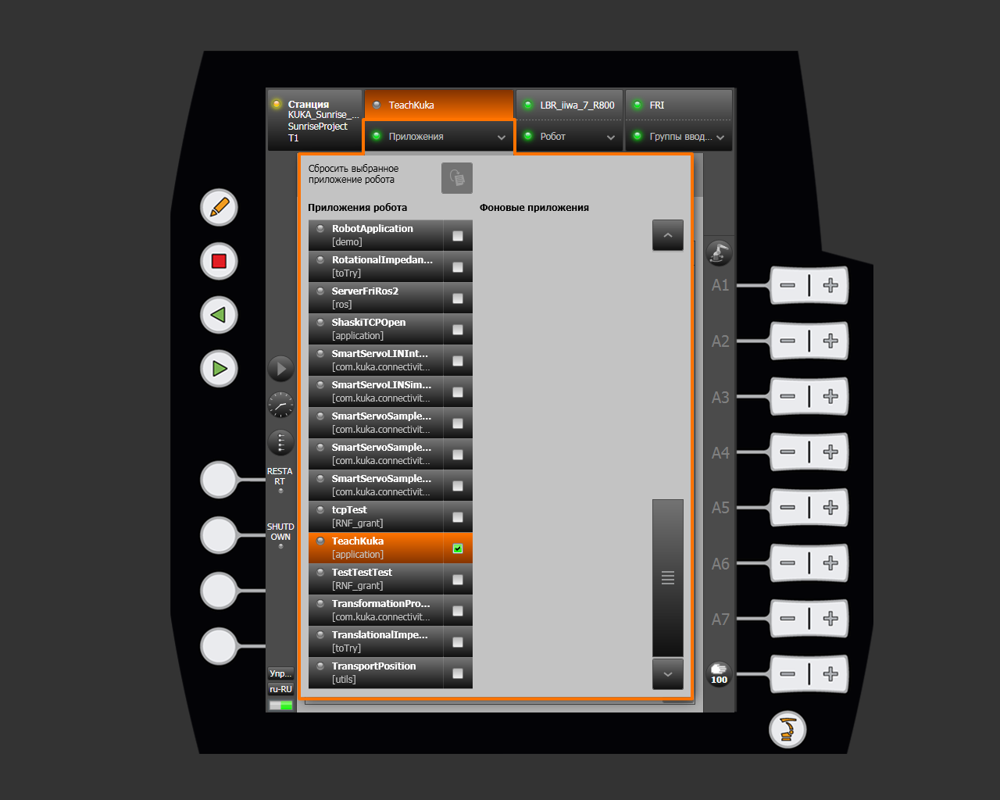
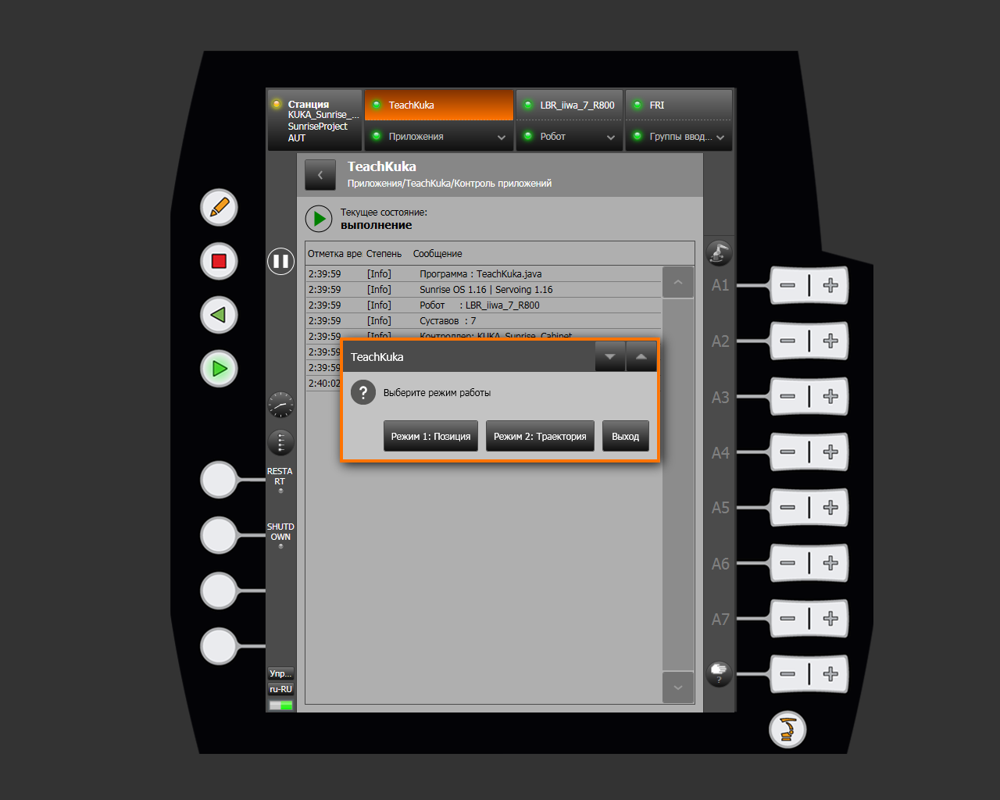
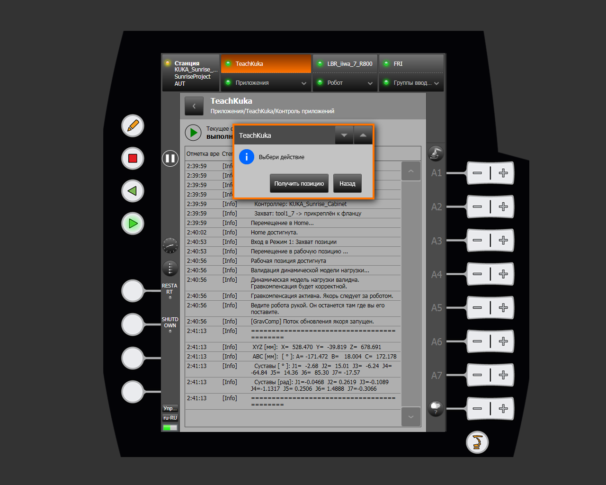
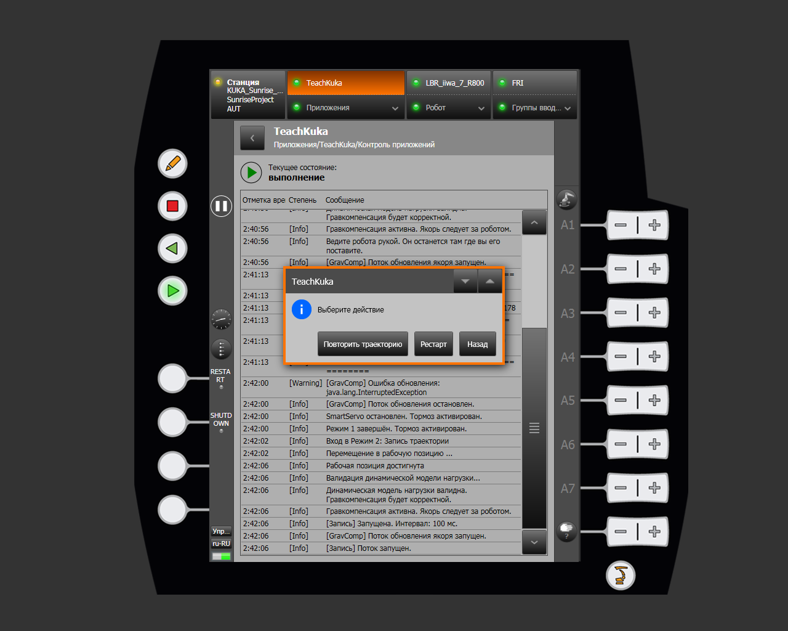

# TeachKuka

**TeachKuka** is a SunriseWorkbench application for manually teaching the KUKA LBR iiwa. Without writing a trajectory in code, an operator can guide the robot by hand, save a position, and record and replay a motion sequence.

The program uses gravity compensation. When enabled, the robot is easy to guide by hand and holds the position set by the operator. This is useful for quickly teaching simple operations, checking the workspace, and preparing repeatable motions.

The source code is located at [`src/iiwa_sunrise/src/TeachKuka.java`](https://github.com/Daniel-Robotic/lightweight-cobot/blob/dev/src/iiwa_sunrise/src/TeachKuka.java). Open or download the file to add it to a Sunrise project.

!!! warning "Safety"
    Before starting, make sure that the workspace is clear and that the robot is not executing another motion. Continuously monitor the robot during trajectory playback. Do not run the program near people or objects if motion could cause injury or equipment damage.

## Tool configuration

The program attaches a tool to the robot flange through this annotation:

=== "java"
    ```java
    @Named("tool1")
    private Tool _gripper;
    ```

Replace `tool1` with the name of your tool.

Check the tool and its parameters in Sunrise Workbench:

1. Open the robot project.
2. Go to **Object Templates**.
3. Find the tool installed on the robot.
4. Check its name and **Load data**.
5. Replace `tool1` in the `TeachKuka` class's `@Named(...)` annotation with this name.
6. Verify that mass, center of gravity, and inertia match the physical gripper.

!!! warning "Correct load model"
    The program may start with incorrect load data, but gravity compensation will be inaccurate. The robot may feel too heavy, drift unexpectedly, or fail to hold its position. Calibrate the tool mass and center of gravity to avoid equipment damage.

## Starting the program and main menu

When `TeachKuka` starts, the robot first moves to **Home**. Before entering any operating mode, it passes through Home and moves to the configured working position. The tool named in `@Named(...)` is attached to the robot flange first.

Find and start the program under [Applications](../features/applications.md) on the smartPAD. That section also describes application states and activation.



smartHMI displays the **Select operating mode** menu:

| Menu item | Purpose |
|---|---|
| **Mode 1: Position** | Guide the robot by hand and read the selected position coordinates |
| **Mode 2: Trajectory** | Record, play, and repeat a motion trajectory |
| **Exit** | End the program and return the robot to Home |

In **Position** mode, the robot can be moved by hand. In **Trajectory** mode, the program records the robot motion for later playback. **Exit** ends the program and returns the robot to Home.



## Mode 1: capturing a position

After selecting the mode, the program moves to the working position, checks the load model, and enables gravity compensation. You can now guide the robot by hand; it follows the operator and remains at the selected position.

The following actions are available:

| Action | Result |
|---|---|
| **Get position** | Writes flange `X/Y/Z` in millimeters, `A/B/C` orientation in degrees, and joint positions in degrees and radians to the log |
| **Back** | Disables gravity compensation, stops motion, and engages the brake |

The **Get position** button writes the Cartesian robot pose (`X/Y/Z`, `A/B/C`) and joint positions to the log. **Back** returns to the previous step and moves the robot to `(0, 0, 0, -1.57, 0, 1.57, 0)`.



The following video demonstrates manual guidance in this mode:

<video controls autoplay muted loop playsinline width="50%">
  <source src="../../../../../sunrise/assets/programms/video/HandMode.mp4" type="video/mp4">
  Your browser does not support video playback.
</video>

## Mode 2: recording and playing a trajectory

When this mode starts, the program clears the previous recording, enables gravity compensation, and begins saving current joint positions. A new point is recorded every 100 ms.

Recording is limited to 3,000 points, or about five minutes of motion. When the limit is reached, the program stops recording and writes a message to the log.

### Mode actions

| Action | Result |
|---|---|
| **Replay trajectory** | Stops recording, moves the robot to the initial point, and plays the saved trajectory; a new recording starts afterward |
| **Restart** | Deletes the current trajectory and immediately starts a new recording |
| **Back** | Stops recording and gravity compensation and exits the mode |

After guiding the robot along the required path, select **Replay trajectory**. The program moves the robot to `(0, 0, 0, -1.57, 0, 1.57, 0)` and then replays the recorded motion. If an error occurred during teaching, press **Restart** to discard the recording and begin again. **Back** returns to the previous menu and moves the robot to the working position.



### Playback

Before playback, the program pauses for two seconds so that the operator can move away. It then moves to the first recorded point and replays the motion through SmartServo at 20% relative speed.

During playback, the program monitors external joint torques. If torque on any joint exceeds 6 Nm, the robot holds its current position and pauses the trajectory. Playback continues from the paused point after the path is cleared.

!!! note "Obstacle detection limitation"
    External-torque monitoring can stop a trajectory when unexpected resistance occurs, but it does not replace standard KUKA safety functions. The operator must continuously monitor the workspace.

The following video demonstrates trajectory recording and playback:

<video controls autoplay muted loop playsinline width="50%">
  <source src="../../../../../sunrise/assets/programms/video/TeachMode.mp4" type="video/mp4">
  Your browser does not support video playback.
</video>

## Finishing operation

When the main menu is closed, the program stops active recording and gravity-compensation threads, cancels the active motion, returns the robot to **Home**, and then exits.
