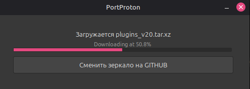

# Установка эмулятора Windows

Для запуска Windows-приложений на Linux используется эмулятор **PortProton**, устанавливаемый через пакетный менеджер **Flatpak** из репозитория **Flathub**.

## Установка Flatpak

Для Ubuntu 18.10 и более поздних версий выполните:

=== "Bash"
    ```bash
    sudo apt update && sudo apt upgrade -y
    sudo apt install flatpak
    ```

## Установка плагина для GNOME Software

Для поддержки Flatpak-пакетов в Центре приложений GNOME:

=== "Bash"
    ```bash
    sudo apt install gnome-software-plugin-flatpak
    ```

## Подключение репозитория Flathub

=== "Bash"
    ```bash
    flatpak remote-add --if-not-exists flathub https://dl.flathub.org/repo/flathub.flatpakrepo
    ```

!!! warning "Перезагрузка"
    После добавления репозитория необходимо перезагрузить систему для применения изменений.

## Установка PortProton

Установить PortProton можно двумя способами: через терминал или через Центр приложений GNOME.

**Через терминал:**

=== "Bash"
    ```bash
    flatpak install flathub ru.linux_gaming.PortProton
    ```

Запуск производиться командой:

=== "Bash"
    ```bash
    flatpak run ru.linux_gaming.PortProton
    ```

**Через центр приложений:**

Также PortProton доступен в Центре приложений GNOME после подключения Flathub.


## Первоначальная настройка

При первом запуске PortProton автоматически устанавливает необходимые зависимости Wine и вспомогательные компоненты. Процесс занимает несколько минут.



После завершения инициализации станут доступны основные функции приложения, в том числе:

- **Настройки Wine** — управление конфигурацией Wine-окружения;
- **Командная строка Windows** — запуск cmd.exe внутри Wine;
- **Файловый менеджер** — доступ к виртуальной файловой системе Windows.


!!! tip "Следующий шаг"
    После установки PortProton перейдите к разделу [Установка SunriseWorkbench](workbench.md).
