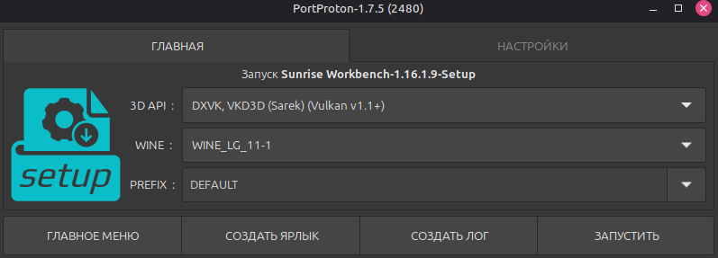
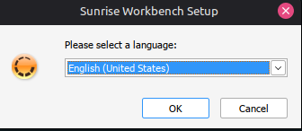
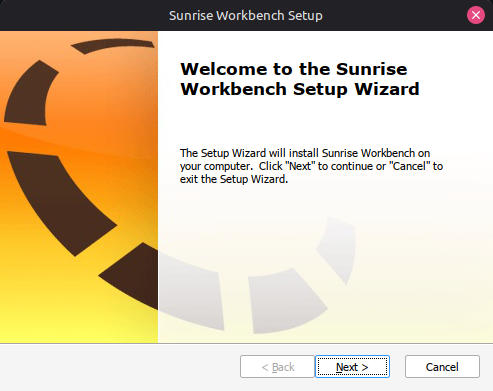
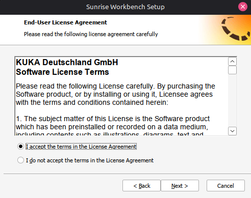
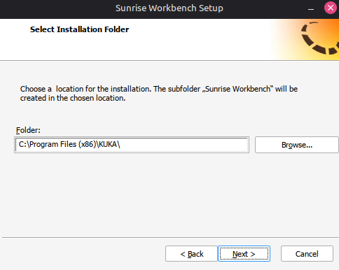
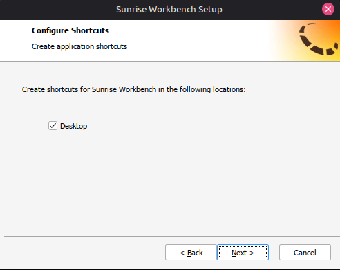
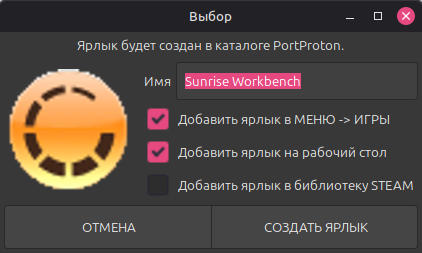
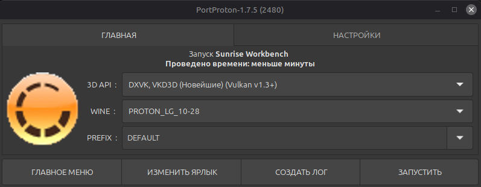
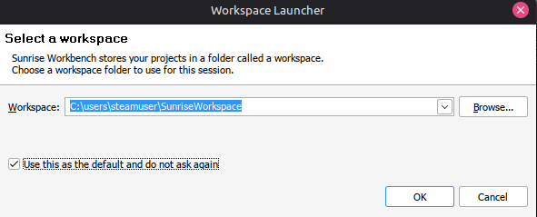
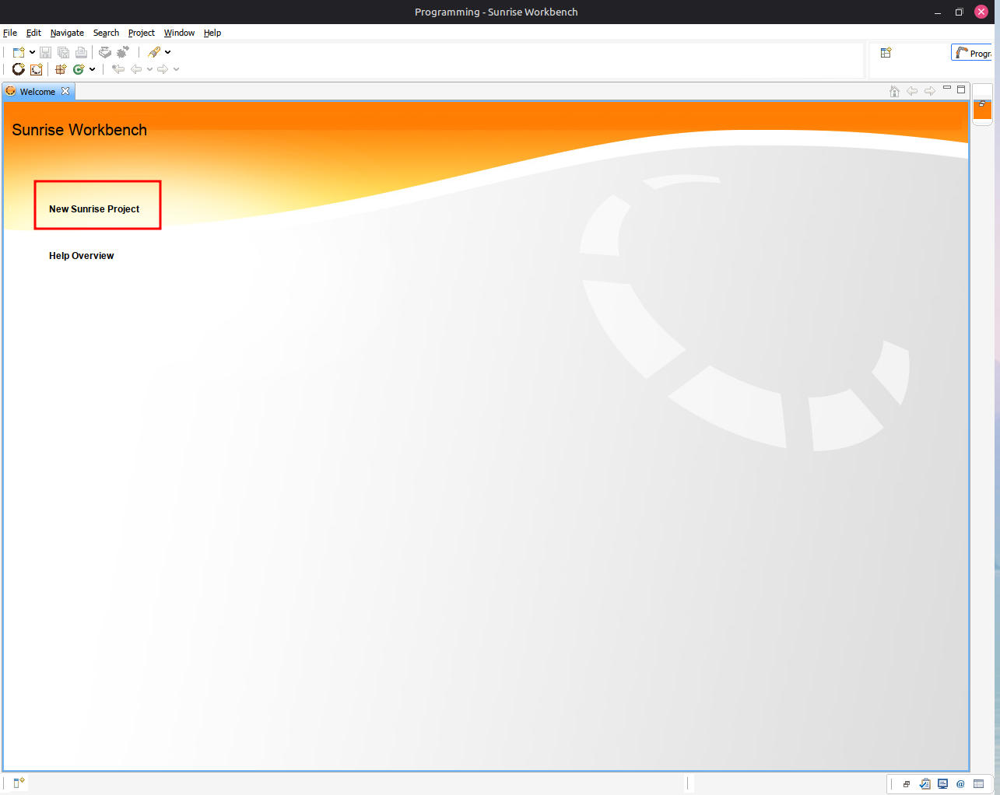

# Установка SunriseWorkbench

В данном разделе описана установка SunriseWorkbench на Linux с использованием эмулятора PortProton.

!!! note "Предварительное требование"
    Перед началом установки убедитесь, что PortProton установлен и настроен. Инструкции приведены в разделе [Установка эмулятора Windows](emulator.md).

## Запуск установщика

**Шаг 1.** Перейдите в папку, содержащую установщик SunriseWorkbench. Нажмите правой кнопкой мыши на файл `.exe` и выберите **Открыть с помощью → PortProton**. В диалоговом окне оставьте настройки по умолчанию и нажмите **Запустить**.

## Процесс установки

**Шаг 2.** В появившемся окне выберите язык установки (по умолчанию — английский) и нажмите **OK**.

**Шаг 3.** В приветственном окне мастера установки нажмите **Next**.

**Шаг 4.** Ознакомьтесь с условиями лицензионного соглашения и подтвердите принятие.

**Шаг 5.** Путь установки рекомендуется оставить по умолчанию.

**Шаг 6.** Установите флажок **Desktop** — ярлык SunriseWorkbench появится на рабочем столе.

**Шаг 7.** Нажмите **install** и дождитесь завершения установки всех необходимых компонентов.

Нажмите на кнопку **Создать ярлык** чтобы он появился на рабочем столе. 

## Первый запуск

**Шаг 8.** После завершения установки запустите SunriseWorkbench через созданный ярлык на рабочем столе. Необходимо будет нажать на кнопку **Запустить** для того чтобы PortProton инициализировал окружение для работы приложения. 

**Шаг 9.** Приложение предложит указать путь к рабочему пространству. Рекомендуется оставить значение по умолчанию и установить флажок **Use this as the default and do not ask again**.

**Шаг 10.** После загрузки главного окна нажмите **New Sunrise Project**.

!!! tip "Дальнейшая настройка"
    Подробные инструкции по конфигурации проекта представлены в разделе [Создание нового проекта](../../config/new-project.md).
    Для полноценной работы также рекомендуется выполнить [Установку библиотек](../../config/libraries.md).
