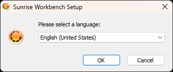
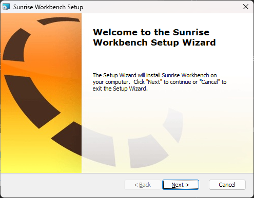
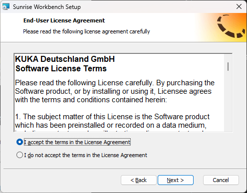
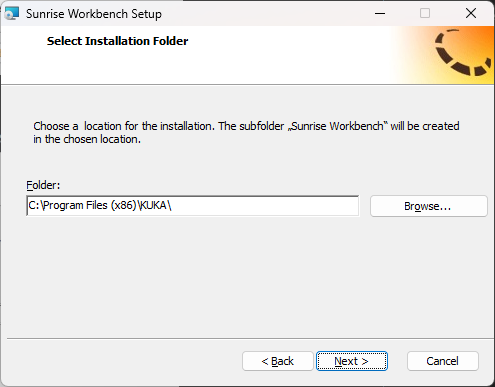
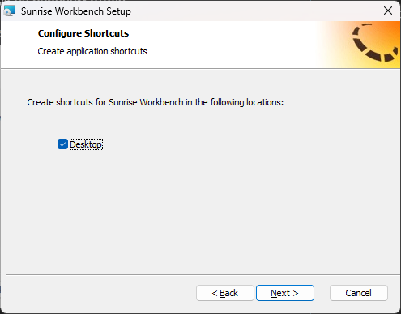
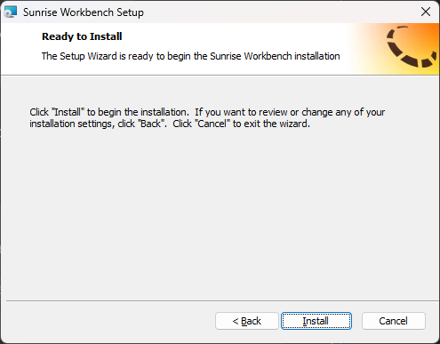
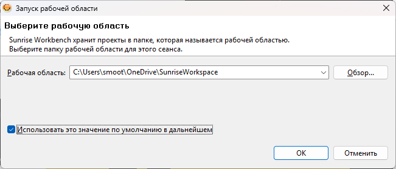
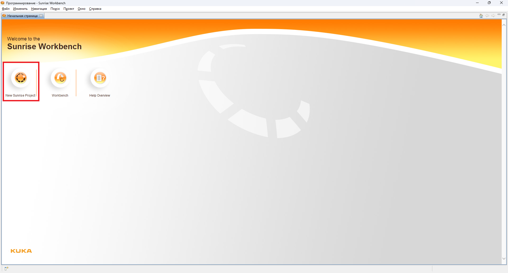

# Installation on Windows

This section explains how to install SunriseWorkbench on Windows.

## Installing SunriseWorkbench

**Step 1.** Start the SunriseWorkbench installer. Select the installation language (English by default) and click **OK**.

**Step 2.** Click **Next** in the installation wizard's welcome window.

**Step 3.** Review the license agreement and accept its terms.

**Step 4.** Keep the default installation path unless you have a specific reason to change it.

**Step 5.** Select **Create Desktop Shortcut** for convenient access.

**Step 6.** Click **Install** and wait until all required components have been installed.

## First launch

**Step 7.** On first launch, the application asks for a workspace path. Keep the default path and select **Use this as the default and do not ask again**.

**Step 8.** After the main window loads, click **New Sunrise Project** to create a project.

!!! tip "Further configuration"
    See [Creating a new project](../config/new-project.md) for project configuration instructions. You should also [install the required libraries](../config/libraries.md).
