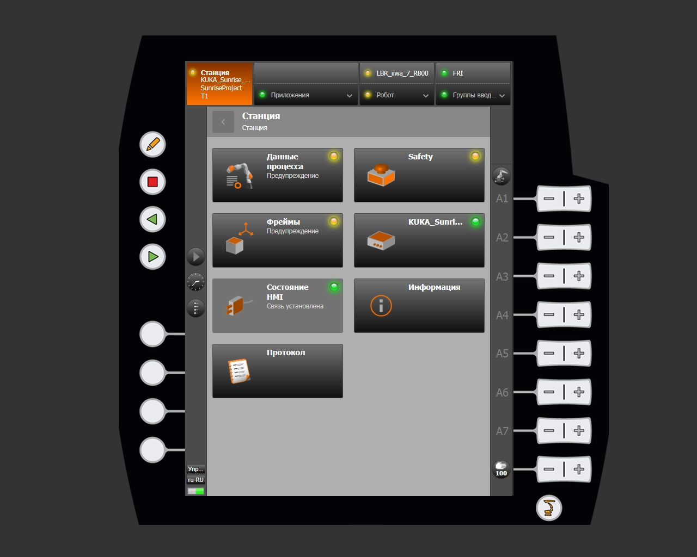
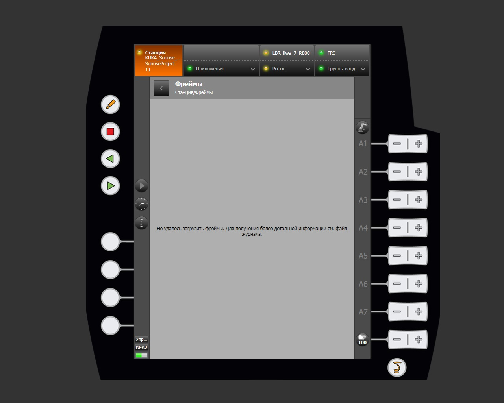

# Ошибка конфигурации

При запуске управляющих программ может возникнуть ошибка, указывающая на то, что инструмент или фрейм не найден. Причиной является аварийное отключение контроллера, при котором конфигурация теряется.

## Признаки проблемы

Проблема проявляется при запуске программ **TeachKuka** или **LBRserver**. Диагностические признаки в главном меню smartHMI:

- Жёлтые предупреждающие индикаторы в разделе **Данные процесса**;
- Жёлтые предупреждающие индикаторы в разделе **Фреймы**.






## Порядок устранения

Выполните следующую последовательность действий:

1. Подключите внешний монитор к контроллеру робота.
2. Перезагрузите контроллер.
3. Выполните вход в систему с учётными данными:
    - Логин: `KukaUser`
    - Пароль: `68kuka1secpw59`

    !!! warning "Раскладка клавиатуры"
        По умолчанию на контроллере установлена немецкая раскладка клавиатуры (`DE`). Учитывайте это при вводе пароля.

4. Скопируйте полный проект на USB-накопитель.
5. Откройте проводник файлов сочетанием клавиш ++win+e++.
6. Перейдите по пути:

    ```
    C:\KRC\Projects
    ```

7. Замените все файлы в данной директории версиями с USB-накопителя.
8. Запустите программу перезагрузки системы с рабочего стола контроллера.


После перезагрузки конфигурация будет восстановлена, и управляющие программы запустятся корректно.
