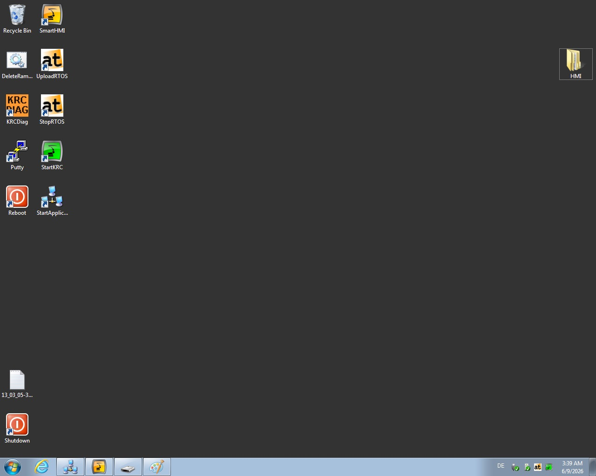

# Configuration error

When a control program starts, it may report that a tool or frame cannot be found. This can happen after an emergency controller shutdown causes the configuration to be lost.

## Symptoms

The problem appears when starting **TeachKuka** or **ServerFriRos2**. The main smartHMI menu shows the following diagnostic signs:

- yellow warning indicators under **Process data**;
- yellow warning indicators under **Frames**.


## Resolution steps

Follow these steps:

1. Connect an external monitor to the robot controller.
2. Restart the controller.
3. Sign in with the following credentials:
    - Username: `KukaUser`
    - Password: `68kuka1secpw59`

    !!! warning "Keyboard layout"
        The controller uses the German keyboard layout (`DE`) by default. Take this into account when entering the password.

4. Copy the complete project to a USB drive.
5. Open File Explorer with ++win+e++.
6. Go to:

    ```
    C:\KRC\Projects
    ```

7. Replace all files in this directory with the versions from the USB drive.
8. Run the system restart application from the controller desktop.



After the restart, the configuration is restored and the control programs should start normally.
